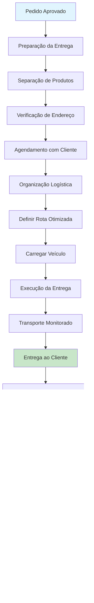

# 🚚 Fluxo de Entrega

🏠 [Home](../index.md) > 🔄 [Fluxos](index.md) > **🚚 Fluxo de Entrega**

#fluxo #entrega #logistica #transporte #processo #intermediario

---

## 🎯 Visão Geral do Fluxo

O **Fluxo de Entrega** coordena todo o processo de entrega de produtos aos clientes, desde a preparação do pedido até a confirmação de recebimento. Este fluxo garante que os produtos cheguem no prazo correto e em perfeitas condições, integrando-se perfeitamente com os módulos de vendas, estoque e financeiro.

### 🚀 **Principais Benefícios**
- **Organização logística** eficiente e padronizada
- **Rastreabilidade completa** da entrega em tempo real
- **Satisfação do cliente** com prazos cumpridos
- **Redução de custos** de transporte e logística
- **Controle total** do processo de entrega
- **Integração automática** com outros módulos do sistema

### 🎯 **Resultados Esperados**
- **95% de entregas** realizadas no prazo
- **Redução de 40%** nos custos de transporte
- **Aumento de 30%** na satisfação do cliente
- **Diminuição de 60%** em reclamações de entrega

---

## 🔄 Visão Geral do Processo

---

## 📋 Etapas Detalhadas

### 1️⃣ **Preparação da Entrega**
**Objetivo**: Organizar e preparar o pedido para entrega

#### **Ações Necessárias**
1. **Separar produtos** conforme pedido aprovado
2. **Verificar endereço** de entrega no sistema
3. **Agendar data** e horário com cliente
4. **Conferir documentação** fiscal necessária
5. **Embalar produtos** adequadamente para transporte

#### **Validações Automáticas**
- ✅ **Estoque disponível** para todos os itens
- ✅ **Endereço completo** e válido
- ✅ **Documentos fiscais** gerados
- ✅ **Forma de pagamento** confirmada

#### **Documentação Relacionada**
- **[Pedidos](../modulos/vendas/pedidos.md)** - Gestão de pedidos
- **[Movimentação de Estoque](../modulos/estoque/movimentacao-estoque.md)** - Baixa de estoque
- **[Emissão de NFCe](../modulos/integracoes/emissao-nfce.md)** - Documentos fiscais

---

### 2️⃣ **Agendamento com Cliente**
**Objetivo**: Definir data, horário e condições de entrega

#### **Canais de Agendamento**
- 📞 **Telefone**: Ligação direta ao cliente
- 📱 **WhatsApp**: Mensagem automática com opções
- 📧 **Email**: Confirmação de agendamento
- 🌐 **Portal do Cliente**: Autoagendamento online

#### **Informações Coletadas**
- **Data preferencial**: Quando o cliente pode receber
- **Horário**: Período de disponibilidade
- **Contato**: Pessoa responsável pelo recebimento
- **Observações**: Instruções especiais de entrega
- **Endereço**: Confirmação e detalhes de acesso

#### **Confirmação Automática**
- **SMS** com confirmação de agendamento
- **Email** com detalhes da entrega
- **WhatsApp** com link de rastreamento
- **Notificação** no sistema para equipe

---

### 3️⃣ **Organização Logística**
**Objetivo**: Planejar a logística de entrega de forma otimizada

#### **Planejamento de Rota**
1. **Definir rota** otimizada usando GPS
2. **Agrupar entregas** por região
3. **Considerar trânsito** e horários de pico
4. **Calcular tempo** estimado de entrega
5. **Preparar documentação** de transporte

#### **Recursos Necessários**
- **Veículo adequado** ao tipo e volume de produtos
- **Motorista habilitado** e treinado
- **Documentos fiscais** completos
- **Equipamentos** de carga/descarga
- **Materiais** de embalagem e proteção

#### **Otimização Inteligente**
- **Algoritmo de rota** para menor distância
- **Agrupamento** por proximidade geográfica
- **Consideração de trânsito** em tempo real
- **Balanceamento** de carga do veículo

---

### 4️⃣ **Execução da Entrega**
**Objetivo**: Realizar a entrega ao cliente conforme planejado

#### **Processo de Entrega**
1. **Transportar produtos** seguindo rota otimizada
2. **Monitorar progresso** via GPS
3. **Entregar ao cliente** ou responsável autorizado
4. **Obter confirmação** de recebimento
5. **Verificar produtos** se solicitado pelo cliente

#### **Controles de Qualidade**
- **Estado dos produtos** na entrega
- **Documentação fiscal** completa
- **Identificação** do recebedor
- **Horário** de entrega registrado
- **Assinatura** ou confirmação digital

#### **Comunicação em Tempo Real**
- **Notificação** ao cliente sobre saída
- **Atualizações** de localização via GPS
- **Previsão** de chegada atualizada
- **Confirmação** de entrega imediata

---

### 5️⃣ **Finalização do Processo**
**Objetivo**: Concluir o processo de entrega e integrar com outros módulos

#### **Ações Finais**
1. **Registrar entrega** no sistema
2. **Atualizar status** do pedido para "Entregue"
3. **Processar pagamento** se na entrega
4. **Arquivar documentos** de entrega
5. **Notificar cliente** sobre conclusão

#### **Integração com Outros Módulos**
- **Vendas**: Atualização automática de status
- **Financeiro**: Processamento de pagamento
- **Estoque**: Confirmação de saída definitiva
- **CRM**: Atualização do histórico de atendimento

---

## 💡 Casos de Uso

### 🏪 **Caso 1: Entrega Local (Mesma Cidade)**
**Situação**: Cliente mora na mesma cidade da loja

#### **Cenário Detalhado**
- **Cliente**: Maria Silva, comprou móveis para jardim
- **Produtos**: 5 itens, peso total 50kg
- **Distância**: 15km da loja
- **Prazo**: Entrega no mesmo dia

#### **Processo Executado**
1. **Agendamento** para período da tarde
2. **Rota otimizada** incluindo 3 outras entregas
3. **Veículo adequado** (caminhonete)
4. **Entrega realizada** às 15:30
5. **Cliente satisfeito** com pontualidade

#### **Resultados**
- ✅ **Entrega no prazo** prometido
- ✅ **Produtos em perfeito estado**
- ✅ **Cliente satisfeito** (nota 5/5)
- ✅ **Custo otimizado** com múltiplas entregas

---

### 🚚 **Caso 2: Entrega Regional (Outras Cidades)**
**Situação**: Cliente em cidade vizinha, 80km de distância

#### **Cenário Detalhado**
- **Cliente**: João Santos, empresa de construção
- **Produtos**: Materiais de construção, 500kg
- **Distância**: 80km da loja
- **Prazo**: 2 dias úteis

#### **Processo Executado**
1. **Planejamento** com 2 dias de antecedência
2. **Parceria** com transportadora local
3. **Rastreamento** durante todo o transporte
4. **Entrega coordenada** no canteiro de obras
5. **Confirmação** via WhatsApp

#### **Resultados**
- ✅ **Entrega no prazo** combinado
- ✅ **Rastreamento completo** do processo
- ✅ **Parceria eficiente** com transportadora
- ✅ **Cliente fidelizado** para próximas compras

---

### 📦 **Caso 3: Entrega Especial (Produtos Frágeis)**
**Situação**: Produtos de alto valor e frágeis

#### **Cenário Detalhado**
- **Cliente**: Loja de decoração, produtos importados
- **Produtos**: Peças de cristal, R$ 5.000,00
- **Cuidados**: Extrema fragilidade
- **Seguro**: Obrigatório para transporte

#### **Processo Executado**
1. **Embalagem especial** com proteção reforçada
2. **Seguro de transporte** contratado
3. **Motorista especializado** em cargas frágeis
4. **Acompanhamento** em tempo real
5. **Entrega com protocolo** específico

#### **Resultados**
- ✅ **Produtos entregues** sem avarias
- ✅ **Seguro** não foi necessário acionar
- ✅ **Cliente confiante** no processo
- ✅ **Referência** para outros clientes

---

## 🔧 Funcionalidades Avançadas

### 📱 **Rastreamento em Tempo Real**
- **GPS integrado** no veículo de entrega
- **Notificações automáticas** ao cliente
- **Previsão de chegada** atualizada constantemente
- **Histórico completo** de localização
- **Alertas** de atraso ou desvio de rota

### 📧 **Comunicação Automática**
- **Email** de confirmação de entrega
- **SMS** com previsão de chegada
- **WhatsApp** com atualizações em tempo real
- **Notificações push** no aplicativo móvel
- **Portal do cliente** com status atualizado

### 🤖 **Inteligência Artificial**
- **Otimização de rotas** com machine learning
- **Previsão de demanda** por região
- **Análise de padrões** de entrega
- **Sugestões** de melhoria automáticas
- **Alertas preditivos** de problemas

### 📊 **Analytics e Relatórios**
- **Performance** de entregas por período
- **Tempo médio** de entrega por região
- **Custos** detalhados por entrega
- **Satisfação** do cliente mensurada
- **KPIs** de logística em tempo real

---

## 🚨 Alertas e Validações

### ⚠️ **Validações Automáticas**
- **Endereço válido** e completo no sistema
- **Produtos disponíveis** em estoque
- **Documentação fiscal** correta e completa
- **Capacidade do veículo** adequada à carga
- **Motorista habilitado** para o tipo de carga

### 🔔 **Alertas Importantes**
- **Atraso na entrega** - notificação imediata
- **Problemas de trânsito** - rota alternativa
- **Cliente não encontrado** - reagendamento
- **Produtos danificados** - protocolo de troca
- **Documentação incompleta** - correção urgente

### 📋 **Checklist de Entrega**
- [ ] Produtos separados e conferidos
- [ ] Embalagem adequada ao transporte
- [ ] Documentação fiscal completa
- [ ] Endereço validado e confirmado
- [ ] Agendamento confirmado com cliente
- [ ] Veículo e motorista designados
- [ ] Rota otimizada definida
- [ ] Seguro de transporte (se necessário)

---

## 📊 Relatórios Disponíveis

### 📈 **Relatórios Operacionais**
1. **Entregas do Dia**: Programação e status atual
2. **Entregas por Período**: Análise temporal detalhada
3. **Entregas por Região**: Distribuição geográfica
4. **Performance de Entrega**: Indicadores de qualidade
5. **Motoristas**: Produtividade individual

### 📊 **Relatórios Gerenciais**
1. **Custo por Entrega**: Análise de custos detalhada
2. **Tempo de Entrega**: Análise de prazos e eficiência
3. **Satisfação do Cliente**: Feedback e avaliações
4. **Otimização de Rotas**: Sugestões de melhoria
5. **ROI de Logística**: Retorno sobre investimento

### 📋 **Relatórios de Compliance**
1. **Documentação Fiscal**: Conformidade com legislação
2. **Seguros de Transporte**: Coberturas e sinistros
3. **Habilitação de Motoristas**: Validade de documentos
4. **Manutenção de Veículos**: Histórico e programação
5. **Auditoria de Entregas**: Rastro completo de processos

---

## 🔧 Configurações Necessárias

### ⚙️ **Setup Inicial**
1. **Cadastrar veículos** da frota própria
2. **Configurar motoristas** e habilitações
3. **Definir regiões** de entrega
4. **Estabelecer prazos** por região
5. **Configurar custos** de transporte
6. **Integrar GPS** e sistemas de rastreamento

### 🎯 **Parâmetros Importantes**
- **Prazo padrão**: 2 dias úteis para cidade
- **Prazo regional**: 3-5 dias úteis
- **Valor mínimo**: R$ 100,00 para entrega gratuita
- **Taxa de entrega**: R$ 15,00 para valores menores
- **Horário de entrega**: 8h às 18h

### 🔗 **Integrações Necessárias**
- **Correios**: Para consulta de CEP
- **Google Maps**: Para otimização de rotas
- **WhatsApp Business**: Para comunicação
- **SEFAZ**: Para emissão de documentos fiscais
- **Transportadoras**: Para entregas regionais

---

## 💡 Dicas e Boas Práticas

### ✅ **Melhores Práticas**
1. **Sempre confirme** o agendamento com cliente
2. **Mantenha comunicação** durante o transporte
3. **Embale adequadamente** todos os produtos
4. **Documente** qualquer problema na entrega
5. **Solicite feedback** após cada entrega

### 🎯 **Otimização de Resultados**
- **Agrupe entregas** por região para reduzir custos
- **Use horários alternativos** para evitar trânsito
- **Mantenha relacionamento** com transportadoras parceiras
- **Invista em tecnologia** de rastreamento
- **Treine equipe** regularmente

### ⚠️ **Cuidados Especiais**
- **Produtos frágeis**: Embalagem reforçada
- **Alto valor**: Seguro obrigatório
- **Perecíveis**: Transporte refrigerado
- **Grandes volumes**: Veículo adequado
- **Documentação**: Sempre completa

---

## 🚨 Pontos de Atenção

### 🔴 **Riscos Críticos**
- **Atraso na entrega** - impacto na satisfação
- **Produtos danificados** - custo de reposição
- **Documentação incorreta** - problemas fiscais
- **Endereço errado** - retrabalho e custo
- **Cliente ausente** - reagendamento necessário

### 🟡 **Riscos Médios**
- **Trânsito intenso** - atraso moderado
- **Problemas climáticos** - reagendamento
- **Veículo quebrado** - backup necessário
- **Motorista doente** - substituição
- **Sistema fora do ar** - processo manual

### 🟢 **Controles Preventivos**
- **Manutenção preventiva** de veículos
- **Backup de motoristas** treinados
- **Rotas alternativas** mapeadas
- **Comunicação proativa** com clientes
- **Seguro abrangente** para todas as cargas

---

## 📚 Documentação Relacionada

### 🔗 **Módulos Integrados**
- **[Vendas - Pedidos](../modulos/vendas/pedidos.md)** - Origem das entregas
- **[Estoque - Movimentação](../modulos/estoque/movimentacao-estoque.md)** - Baixa de produtos
- **[Financeiro - Cobrança](../modulos/financeiro/contas-a-receber.md)** - Pagamentos na entrega
- **[CRM - Atendimento](../modulos/crm/gestao-leads.md)** - Histórico de relacionamento

### 🔄 **Fluxos Relacionados**
- **[Fluxo de Vendas](fluxo-vendas-completo.md)** - Processo anterior
- **[Fluxo de Cobrança](fluxo-cobranca.md)** - Processo posterior
- **[Fluxo de Atendimento](fluxo-atendimento.md)** - Suporte ao cliente
- **[Fluxo de Estoque](fluxo-inventario.md)** - Controle de produtos

### 💡 **Casos de Uso Relacionados**
- **[Comércio Geral](../casos-uso/comercio-geral/index.md)** - Exemplos práticos
- **[Venda no Balcão](../casos-uso/comercio-geral/venda-balcao.md)** - Processo completo
- **[Loja com PIX](../casos-uso/comercio-geral/loja-pix-automatico.md)** - Pagamentos digitais

---

## 🏷️ Tags
`#fluxo` `#entrega` `#logistica` `#transporte` `#processo` `#intermediario`

---

**Última atualização**: Janeiro 2025  
**Versão do documento**: 2.0  
**Responsável**: Equipe de Documentação White ERP
