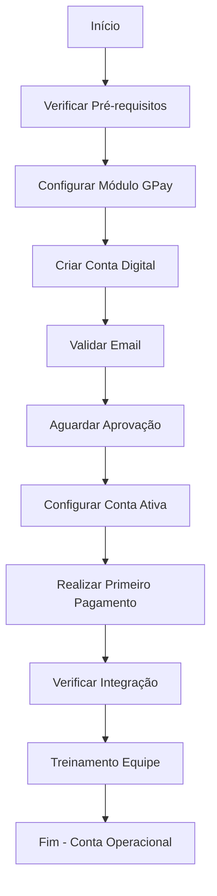

# 🔄 Fluxo: Onboarding Conta Digital

🏠 [Home](../../index.md) > 📋 [Fluxos](../index.md) > **Onboarding Conta Digital**

#fluxo #gpay #onboarding #conta-digital #passo-a-passo #processo #iniciante

## 🎯 Objetivo do Fluxo

Este fluxo descreve o processo completo de **onboarding** (integração) de uma nova conta digital GPay, desde a configuração inicial até o primeiro pagamento, garantindo que o cliente tenha uma experiência suave e bem-sucedida.

### 🚀 **Resultados Esperados**
- ✅ **Conta digital ativa** e funcional
- ✅ **Primeiro pagamento** realizado com sucesso
- ✅ **Integração completa** com o ERP
- ✅ **Cliente confiante** para usar o sistema

### ⏱️ **Tempo Estimado**
- **Configuração**: 30 minutos
- **Aprovação**: 1-5 dias úteis
- **Primeiro uso**: 15 minutos
- **Total**: 5-7 dias

## 📊 Visão Geral do Processo

## 🔧 Etapas Detalhadas

### **Etapa 1: Verificação de Pré-requisitos** ⏱️ 10 min

#### **👤 Responsável**: Administrador do Sistema

#### **📋 Checklist de Pré-requisitos**
- [ ] **CNPJ ativo** na Receita Federal
- [ ] **Email empresarial** válido e acessível
- [ ] **Dados bancários** atualizados
- [ ] **Documentos** dos sócios disponíveis
- [ ] **Faturamento mensal** conhecido
- [ ] **Conta Asaas** criada (ou será criada)

#### **🔧 Ações Necessárias**
1. **Reunir documentação**:
   - Cartão CNPJ atualizado
   - Comprovante de endereço da empresa
   - CPF e RG dos sócios
   - Última declaração de faturamento

2. **Validar informações**:
   - Consultar CNPJ na Receita Federal
   - Verificar se email está ativo
   - Confirmar dados bancários atuais

#### **✅ Critério de Conclusão**
Todos os documentos reunidos e validados.

---

### **Etapa 2: Configuração do Módulo GPay** ⏱️ 15 min

#### **👤 Responsável**: Administrador Técnico

#### **🔧 Configurações Necessárias**
1. **Ativar módulo GPay**:
   - Acessar Configurações > Módulos
   - Habilitar "GPay - Pagamentos Digitais"
   - Salvar configurações

2. **Configurar integração Asaas**:
   - Obter token de API da Asaas
   - Configurar ambiente (sandbox/produção)
   - Testar conectividade

3. **Configurar White Label**:
   - Definir conta padrão GPay
   - Configurar templates de email
   - Configurar SMTP para notificações

#### **📊 Validação**
- [ ] Módulo GPay aparece no dashboard
- [ ] Integração Asaas funcionando
- [ ] Envio de email configurado

#### **✅ Critério de Conclusão**
Box GPay visível no dashboard com opção "Criar Conta Digital".

---

### **Etapa 3: Criação da Conta Digital** ⏱️ 15 min

#### **👤 Responsável**: Usuário Final

#### **🔧 Processo de Criação**
1. **Acessar criação**:
   - No dashboard, clicar no box GPay
   - Clicar em "Criar Conta Digital"
   - Escolher "Novo cliente" ou "Cliente existente"

2. **Preencher dados**:
   - **Dados pessoais/empresariais**
   - **Endereço completo**
   - **Informações de contato**
   - **Documentos necessários**

3. **Validação por email**:
   - Solicitar código de validação
   - Verificar email recebido
   - Inserir código de 6 dígitos

4. **Enviar para análise**:
   - Revisar todos os dados
   - Confirmar informações
   - Submeter para aprovação

#### **📊 Validação**
- [ ] Formulário preenchido completamente
- [ ] Email validado com sucesso
- [ ] Confirmação de envio recebida

#### **✅ Critério de Conclusão**
Mensagem "Conta enviada para análise" exibida.

---

### **Etapa 4: Acompanhamento da Aprovação** ⏱️ 1-5 dias

#### **👤 Responsável**: Usuário Final + Suporte

#### **🔧 Monitoramento**
1. **Verificar status**:
   - Box GPay mostra "Documentos em análise"
   - Aguardar email da Asaas
   - Monitorar por 5 dias úteis

2. **Responder solicitações**:
   - Se solicitada documentação adicional
   - Enviar esclarecimentos necessários
   - Acompanhar prazos

3. **Receber aprovação**:
   - Email de confirmação da Asaas
   - Dados bancários disponibilizados
   - Box GPay atualizado

#### **📊 Status Possíveis**
- **🟡 Em análise**: Aguardando verificação
- **🔴 Documentação pendente**: Enviar docs adicionais
- **🟢 Aprovada**: Conta ativa e funcional
- **🔴 Reprovada**: Corrigir e reenviar

#### **✅ Critério de Conclusão**
Conta aprovada com dados bancários disponíveis.

---

### **Etapa 5: Configuração da Conta Ativa** ⏱️ 10 min

#### **👤 Responsável**: Administrador do Sistema

#### **🔧 Configurações Pós-Aprovação**
1. **Verificar dados bancários**:
   - Agência, conta e dígito
   - API Key gerada
   - Wallet ID configurado

2. **Configurar limites**:
   - Definir limites diários
   - Configurar alertas
   - Estabelecer políticas de uso

3. **Integrar com financeiro**:
   - Vincular conta ao plano de contas
   - Configurar categorias de despesa
   - Testar lançamentos automáticos

#### **📊 Validação**
- [ ] Saldo da conta visível
- [ ] Botões de ação funcionando
- [ ] Integração financeira ativa

#### **✅ Critério de Conclusão**
Box GPay totalmente funcional com saldo visível.

---

### **Etapa 6: Primeiro Pagamento de Teste** ⏱️ 15 min

#### **👤 Responsável**: Usuário Final

#### **🔧 Teste Prático**
1. **Preparar teste**:
   - Ter saldo na conta (transferir se necessário)
   - Escolher boleto de baixo valor
   - Preparar linha digitável

2. **Realizar pagamento**:
   - Clicar em "Pagar" no GPay
   - Inserir linha digitável
   - Simular pagamento
   - Conferir dados
   - Confirmar pagamento

3. **Verificar resultado**:
   - Comprovante gerado
   - Saldo atualizado
   - Lançamento no financeiro
   - Extrato atualizado

#### **📊 Validação**
- [ ] Pagamento processado com sucesso
- [ ] Comprovante disponível
- [ ] Lançamento automático criado
- [ ] Saldo debitado corretamente

#### **✅ Critério de Conclusão**
Primeiro pagamento realizado com sucesso total.

---

### **Etapa 7: Treinamento da Equipe** ⏱️ 30 min

#### **👤 Responsável**: Administrador + Equipe

#### **🔧 Capacitação**
1. **Apresentar funcionalidades**:
   - Demonstrar pagamentos
   - Mostrar consulta de saldo
   - Explicar relatórios

2. **Treinar processos**:
   - Pagamento de boletos
   - Transferências
   - PIX básico
   - Consulta de extrato

3. **Estabelecer rotinas**:
   - Quem pode fazer pagamentos
   - Limites por usuário
   - Processo de aprovação
   - Controles internos

#### **📚 Material de Apoio**
- [Documentação GPay](../modulos/gpay/index.md)
- [Guia de Pagamentos](../modulos/gpay/pagamentos-transferencias.md)
- [Gestão de Saldo](../modulos/gpay/gestao-saldo-extrato.md)

#### **✅ Critério de Conclusão**
Equipe capacitada e confiante para usar o sistema.

---

## 🎯 Marcos de Sucesso

### **✅ Marco 1: Setup Completo** (Dia 1)
- Módulo configurado
- Conta criada e enviada
- Email validado

### **✅ Marco 2: Aprovação Obtida** (Dia 2-5)
- Conta aprovada pela Asaas
- Dados bancários recebidos
- Sistema integrado

### **✅ Marco 3: Operação Ativa** (Dia 6-7)
- Primeiro pagamento realizado
- Equipe treinada
- Processos estabelecidos

## 🆘 Pontos de Atenção

### ⚠️ **Possíveis Problemas**

#### **🔴 Conta Reprovada**
**Ação**: 
1. Analisar motivo no email
2. Corrigir documentação
3. Reenviar solicitação
4. Acompanhar novo prazo

#### **🔴 Integração Falha**
**Ação**:
1. Verificar token Asaas
2. Testar conectividade
3. Revisar configurações
4. Contatar suporte técnico

#### **🔴 Primeiro Pagamento Falha**
**Ação**:
1. Verificar saldo disponível
2. Validar linha digitável
3. Testar com valor menor
4. Analisar logs de erro

## 📊 Métricas de Sucesso

### 🎯 **KPIs do Onboarding**
- **Taxa de aprovação**: > 90%
- **Tempo médio**: < 5 dias
- **Primeiro pagamento**: < 24h após aprovação
- **Satisfação**: > 4.5/5

### 📈 **Acompanhamento**
- **Contas criadas**: Mensal
- **Aprovações**: Semanal
- **Tempo de processo**: Por conta
- **Problemas**: Log detalhado

## 📞 Suporte Durante o Processo

### 🆘 **Canais de Ajuda**
- **[FAQ GPay](../modulos/gpay/faq-gpay.md)** - Dúvidas comuns
- **[Troubleshooting](../modulos/gpay/troubleshooting-gpay.md)** - Problemas técnicos
- **[Suporte Técnico](../guias/contato-suporte.md)** - Atendimento especializado
- **[Suporte Asaas](https://suporte.asaas.com)** - Questões da plataforma

### 📚 **Documentação de Apoio**
- **[Criação de Conta Digital](../modulos/gpay/criacao-conta-digital.md)**
- **[Configuração Inicial](../modulos/gpay/configuracao-inicial.md)**
- **[Integração Asaas](../modulos/gpay/integracao-asaas.md)**

---

## ✅ Checklist Final de Onboarding

Use este checklist para garantir que nada foi esquecido:

### **📋 Preparação**
- [ ] Documentos reunidos e validados
- [ ] Conta Asaas criada ou disponível
- [ ] Email empresarial configurado

### **🔧 Configuração**
- [ ] Módulo GPay ativado
- [ ] Integração Asaas configurada
- [ ] Templates de email configurados

### **🏦 Conta Digital**
- [ ] Formulário preenchido completamente
- [ ] Email validado com código
- [ ] Conta enviada para análise

### **✅ Aprovação**
- [ ] Conta aprovada pela Asaas
- [ ] Dados bancários recebidos
- [ ] Box GPay totalmente funcional

### **💳 Primeiro Uso**
- [ ] Primeiro pagamento realizado
- [ ] Comprovante gerado
- [ ] Integração financeira funcionando

### **👥 Treinamento**
- [ ] Equipe capacitada
- [ ] Processos estabelecidos
- [ ] Controles internos definidos

> **🎯 Sucesso**: Conta digital GPay totalmente operacional e equipe capacitada para uso diário.

> **💡 Próximo passo**: Estabelecer rotinas de uso e monitoramento para maximizar os benefícios! 