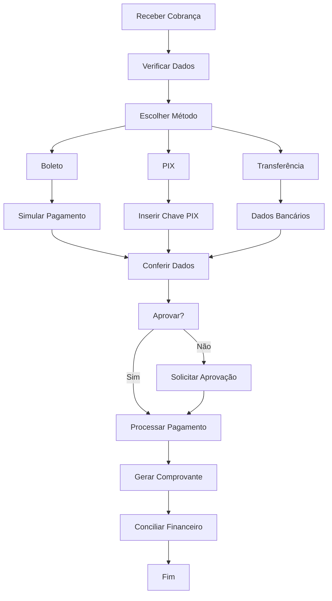

# 🔄 Fluxo: Pagamento de Fornecedor via GPay

🏠 [Home](../../index.md) > 📋 [Fluxos](../index.md) > **Pagamento de Fornecedor via GPay**

#fluxo #gpay #pagamento #fornecedor #boleto #pix #processo #intermediario

## 🎯 Objetivo do Fluxo

Este fluxo descreve o processo completo de **pagamento de fornecedores** utilizando a conta digital GPay, desde o recebimento da cobrança até a conciliação no financeiro, garantindo eficiência, controle e economia.

### 🚀 **Resultados Esperados**
- ✅ **Pagamento processado** com sucesso
- ✅ **Economia de custos** vs bancos tradicionais
- ✅ **Integração automática** com financeiro
- ✅ **Comprovantes organizados** e acessíveis

### ⏱️ **Tempo Estimado**
- **Pagamento simples**: 3-5 minutos
- **Pagamento com aprovação**: 10-15 minutos
- **Processamento**: Instantâneo (PIX) ou 1 dia útil

### 💰 **Economia Esperada**
- **40-60% menos** em tarifas bancárias
- **PIX gratuito** para a maioria das operações
- **Sem taxas** para transferências Asaas

## 📊 Visão Geral do Processo

## 🔧 Etapas Detalhadas

### **Etapa 1: Recebimento da Cobrança** ⏱️ 1 min

#### **👤 Responsável**: Setor de Compras/Financeiro

#### **📋 Tipos de Cobrança**
- **📄 Boleto bancário**: Linha digitável ou PDF
- **⚡ PIX**: Chave ou QR Code
- **🏦 Dados bancários**: Para transferência tradicional
- **📧 Email**: Com informações de pagamento

#### **🔧 Ações Necessárias**
1. **Receber documentos**:
   - Nota fiscal do fornecedor
   - Boleto ou dados para pagamento
   - Ordem de compra relacionada

2. **Validar informações**:
   - Conferir valores
   - Verificar vencimentos
   - Confirmar dados do fornecedor

#### **✅ Critério de Conclusão**
Cobrança recebida e validada para pagamento.

---

### **Etapa 2: Verificação e Preparação** ⏱️ 2 min

#### **👤 Responsável**: Operador Financeiro

#### **🔧 Verificações Necessárias**
1. **Conferir dados**:
   - Valor correto conforme nota fiscal
   - Data de vencimento
   - Dados do fornecedor
   - Centro de custo

2. **Verificar saldo**:
   - Consultar saldo GPay
   - Verificar disponibilidade
   - Transferir saldo se necessário

3. **Preparar documentação**:
   - Nota fiscal em mãos
   - Dados para pagamento
   - Categoria de despesa definida

#### **📊 Validação**
- [ ] Dados conferidos e corretos
- [ ] Saldo suficiente disponível
- [ ] Documentação organizada

#### **✅ Critério de Conclusão**
Tudo preparado para iniciar o pagamento.

---

### **Etapa 3: Escolha do Método de Pagamento** ⏱️ 30 seg

#### **👤 Responsável**: Operador Financeiro

#### **🔧 Critérios de Escolha**

#### **⚡ PIX (Recomendado)**
**Quando usar**:
- Pagamento urgente
- Fornecedor aceita PIX
- Horário comercial
- Valor até limite PIX

**Vantagens**:
- Instantâneo
- Menor custo
- Disponível 24/7
- Comprovante imediato

#### **📄 Boleto Bancário**
**Quando usar**:
- Fornecedor enviou boleto
- Pagamento programado
- Controle de vencimento
- Preferência do fornecedor

**Vantagens**:
- Dados pré-preenchidos
- Simulação prévia
- Agendamento possível
- Rastreamento completo

#### **🏦 Transferência (TED/DOC)**
**Quando usar**:
- Fornecedor não aceita PIX
- Valor acima limite PIX
- Necessidade de DOC
- Banco não integrado

**Vantagens**:
- Valores altos
- Tradicional e seguro
- Comprovante bancário
- Aceito universalmente

#### **✅ Critério de Conclusão**
Método de pagamento escolhido conforme situação.

---

### **Etapa 4A: Pagamento via Boleto** ⏱️ 3 min

#### **👤 Responsável**: Operador Financeiro

#### **🔧 Processo Detalhado**
1. **Acessar pagamento**:
   - No dashboard, clicar em GPay
   - Clicar em "Pagar"
   - Escolher "Novo lançamento"

2. **Inserir dados do boleto**:
   - Colar linha digitável
   - Clicar em "Simular Pagamento"
   - Aguardar carregamento dos dados

3. **Conferir informações**:
   - **Favorecido**: Nome e CNPJ corretos
   - **Valor**: Conforme nota fiscal
   - **Vencimento**: Data original
   - **Juros**: Se pago após vencimento

4. **Configurar pagamento**:
   - **Data de pagamento**: Hoje ou agendada
   - **Categoria de despesa**: Selecionar apropriada
   - **Observações**: Nota fiscal, pedido, etc.

5. **Processar**:
   - Clicar em "Pagar"
   - Aguardar confirmação
   - Baixar comprovante

#### **📊 Validação**
- [ ] Dados do boleto corretos
- [ ] Simulação realizada com sucesso
- [ ] Categoria selecionada
- [ ] Pagamento processado

#### **✅ Critério de Conclusão**
Boleto pago e comprovante gerado.

---

### **Etapa 4B: Pagamento via PIX** ⏱️ 2 min

#### **👤 Responsável**: Operador Financeiro

#### **🔧 Processo Detalhado**
1. **Acessar PIX**:
   - No dashboard GPay, clicar em "PIX"
   - Escolher tipo de PIX

2. **Inserir dados**:
   - **PIX por chave**: CPF/CNPJ, email ou telefone
   - **PIX por QR Code**: Escanear código
   - **PIX manual**: Dados bancários completos

3. **Configurar transferência**:
   - **Valor**: Conforme nota fiscal
   - **Descrição**: NF + número, fornecedor
   - **Data**: Imediato ou agendado

4. **Confirmar**:
   - Revisar todos os dados
   - Verificar chave PIX
   - Clicar em "Enviar PIX"
   - Aguardar confirmação

#### **📊 Validação**
- [ ] Chave PIX validada
- [ ] Valor correto inserido
- [ ] Descrição preenchida
- [ ] PIX processado com sucesso

#### **✅ Critério de Conclusão**
PIX enviado e confirmado instantaneamente.

---

### **Etapa 4C: Pagamento via Transferência** ⏱️ 4 min

#### **👤 Responsável**: Operador Financeiro

#### **🔧 Processo Detalhado**
1. **Acessar transferências**:
   - No dashboard GPay, clicar em "Transferir"
   - Escolher tipo de transferência

2. **Dados do destinatário**:
   - **Nome/Razão social**: Conforme nota fiscal
   - **CPF/CNPJ**: Do fornecedor
   - **Banco**: Código ou nome
   - **Agência**: Com ou sem dígito
   - **Conta**: Número da conta
   - **Tipo**: Corrente ou poupança

3. **Configurar transferência**:
   - **Valor**: Conforme cobrança
   - **Descrição**: Finalidade do pagamento
   - **Data**: Hoje ou agendada
   - **Tipo**: TED, DOC ou Asaas

4. **Confirmar**:
   - Revisar dados bancários
   - Verificar taxas
   - Clicar em "Transferir"
   - Aguardar processamento

#### **📊 Validação**
- [ ] Dados bancários corretos
- [ ] Valor conferido
- [ ] Tipo de transferência adequado
- [ ] Transferência processada

#### **✅ Critério de Conclusão**
Transferência realizada e confirmada.

---

### **Etapa 5: Processo de Aprovação** ⏱️ 5-10 min

#### **👤 Responsável**: Aprovador + Operador

#### **🔧 Quando é Necessária**
- **Valores acima do limite** estabelecido
- **Fornecedores novos** ou não cadastrados
- **Pagamentos fora do prazo** normal
- **Política interna** da empresa

#### **🔧 Processo de Aprovação**
1. **Solicitar aprovação**:
   - Sistema gera notificação
   - Email enviado ao aprovador
   - Dados do pagamento anexados

2. **Análise do aprovador**:
   - Revisar nota fiscal
   - Verificar dados do fornecedor
   - Confirmar valor e categoria
   - Aprovar ou rejeitar

3. **Processamento pós-aprovação**:
   - Se aprovado: pagamento processado
   - Se rejeitado: volta para operador
   - Notificação automática do resultado

#### **📊 Validação**
- [ ] Solicitação enviada
- [ ] Aprovador notificado
- [ ] Decisão tomada
- [ ] Ação executada

#### **✅ Critério de Conclusão**
Aprovação obtida e pagamento liberado.

---

### **Etapa 6: Geração de Comprovantes** ⏱️ 1 min

#### **👤 Responsável**: Sistema + Operador

#### **🔧 Comprovantes Gerados**
1. **Comprovante GPay**:
   - Dados da transação
   - Horário de processamento
   - Status da operação
   - Número de referência

2. **Comprovante bancário**:
   - Da plataforma Asaas
   - Dados oficiais
   - Válido para auditoria
   - Formato PDF

3. **Registro no ERP**:
   - Lançamento automático
   - Vinculação com nota fiscal
   - Categoria de despesa
   - Centro de custo

#### **🔧 Organização**
- **Salvar comprovantes** em pasta específica
- **Anexar à nota fiscal** física ou digital
- **Registrar no controle** de pagamentos
- **Enviar para contabilidade** se necessário

#### **✅ Critério de Conclusão**
Todos os comprovantes gerados e organizados.

---

### **Etapa 7: Conciliação Financeira** ⏱️ 2 min

#### **👤 Responsável**: Sistema + Conferente

#### **🔧 Conciliação Automática**
1. **Matching automático**:
   - Sistema identifica o lançamento
   - Vincula com a movimentação GPay
   - Atualiza status para "Pago"
   - Gera relatório de conciliação

2. **Verificação manual**:
   - Conferir se lançamento foi criado
   - Verificar categoria correta
   - Confirmar valor e data
   - Validar centro de custo

#### **🔧 Relatórios Atualizados**
- **Fluxo de caixa**: Saída registrada
- **Contas a pagar**: Status atualizado
- **Extrato GPay**: Movimentação registrada
- **DRE**: Despesa classificada

#### **📊 Validação**
- [ ] Lançamento criado automaticamente
- [ ] Valores conferidos
- [ ] Categoria correta
- [ ] Conciliação completa

#### **✅ Critério de Conclusão**
Pagamento totalmente conciliado no financeiro.

---

## 🎯 Marcos de Sucesso

### **✅ Marco 1: Pagamento Processado** (0-5 min)
- Método escolhido adequadamente
- Dados inseridos corretamente
- Pagamento confirmado

### **✅ Marco 2: Documentação Completa** (5-7 min)
- Comprovantes gerados
- Arquivos organizados
- Registros atualizados

### **✅ Marco 3: Integração Financeira** (7-10 min)
- Lançamento automático criado
- Conciliação realizada
- Relatórios atualizados

## 💰 Análise de Economia

### 📊 **Comparativo de Custos**

| Método | Banco Tradicional | GPay | Economia |
|--------|------------------|------|----------|
| **PIX** | R$ 1,00 | Gratuito | 100% |
| **TED** | R$ 8,00 | R$ 3,50 | 56% |
| **DOC** | R$ 5,00 | R$ 2,00 | 60% |
| **Boleto** | R$ 2,50 | R$ 1,50 | 40% |

### 📈 **Economia Mensal Estimada**
- **100 pagamentos/mês**: Economia de R$ 200-400
- **500 pagamentos/mês**: Economia de R$ 1.000-2.000
- **1000 pagamentos/mês**: Economia de R$ 2.000-4.000

## 🆘 Pontos de Atenção

### ⚠️ **Possíveis Problemas**

#### **🔴 Saldo Insuficiente**
**Ação**:
1. Verificar saldo atual
2. Transferir recursos necessários
3. Aguardar compensação
4. Tentar pagamento novamente

#### **🔴 Dados Incorretos**
**Ação**:
1. Conferir com fornecedor
2. Validar documentos
3. Corrigir informações
4. Reprocessar pagamento

#### **🔴 Falha na Integração**
**Ação**:
1. Verificar conectividade
2. Tentar novamente
3. Fazer lançamento manual
4. Contatar suporte técnico

## 📊 Métricas de Controle

### 🎯 **KPIs do Processo**
- **Tempo médio de pagamento**: < 5 minutos
- **Taxa de erro**: < 1%
- **Economia gerada**: > 40%
- **Satisfação da equipe**: > 4.5/5

### 📈 **Acompanhamento**
- **Pagamentos por dia**: Contagem
- **Métodos utilizados**: Distribuição
- **Valores pagos**: Total mensal
- **Tempo de processo**: Média por tipo

## 📞 Suporte Durante o Processo

### 🆘 **Canais de Ajuda**
- **[FAQ GPay](../modulos/gpay/faq-gpay.md)** - Dúvidas comuns
- **[Troubleshooting](../modulos/gpay/troubleshooting-gpay.md)** - Problemas técnicos
- **[Suporte Técnico](../guias/contato-suporte.md)** - Atendimento especializado

### 📚 **Documentação de Apoio**
- **[Pagamentos e Transferências](../modulos/gpay/pagamentos-transferencias.md)**
- **[Gestão de Saldo](../modulos/gpay/gestao-saldo-extrato.md)**
- **[PIX - Configuração e Uso](../modulos/gpay/pix-configuracao-uso.md)**

---

## ✅ Checklist de Pagamento

Use este checklist para cada pagamento:

### **📋 Preparação**
- [ ] Cobrança recebida e validada
- [ ] Dados do fornecedor conferidos
- [ ] Saldo GPay verificado
- [ ] Documentação organizada

### **💳 Processamento**
- [ ] Método de pagamento escolhido
- [ ] Dados inseridos corretamente
- [ ] Simulação realizada (se boleto)
- [ ] Aprovação obtida (se necessária)

### **📊 Finalização**
- [ ] Pagamento processado com sucesso
- [ ] Comprovante gerado e salvo
- [ ] Lançamento automático criado
- [ ] Conciliação verificada

### **📁 Organização**
- [ ] Comprovantes arquivados
- [ ] Nota fiscal atualizada
- [ ] Controle de pagamentos atualizado
- [ ] Relatórios atualizados

> **🎯 Sucesso**: Fornecedor pago com economia, controle total e integração automática com o financeiro.

> **💡 Dica**: Prefira PIX sempre que possível para máxima economia e agilidade! 