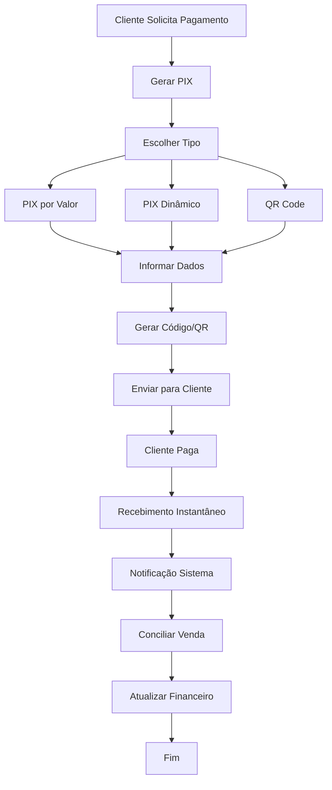

# 🔄 Fluxo: Recebimento via PIX

🏠 [Home](../../index.md) > 📋 [Fluxos](../index.md) > **Recebimento via PIX**

#fluxo #gpay #recebimento #pix #qr-code #vendas #processo #iniciante

## 🎯 Objetivo do Fluxo

Este fluxo descreve o processo completo de **recebimento de pagamentos via PIX** utilizando a conta digital GPay, desde a geração do QR Code até a conciliação no financeiro, facilitando vendas e melhorando o fluxo de caixa.

### 🚀 **Resultados Esperados**
- ✅ **Recebimento instantâneo** via PIX
- ✅ **QR Code gerado** facilmente
- ✅ **Integração automática** com vendas
- ✅ **Controle total** dos recebimentos

### ⏱️ **Tempo Estimado**
- **Geração de PIX**: 1-2 minutos
- **Recebimento**: Instantâneo
- **Conciliação**: Automática
- **Total**: 2-3 minutos

### 💰 **Vantagens do PIX**
- **Gratuito** para recebimentos
- **Disponível 24/7** inclusive finais de semana
- **Sem intermediários** bancários
- **Comprovante imediato** para cliente

## 📊 Visão Geral do Processo

## 🔧 Etapas Detalhadas

### **Etapa 1: Solicitação de Pagamento** ⏱️ 30 seg

#### **👤 Responsável**: Vendedor/Atendente

#### **📋 Cenários Comuns**
- **🛒 Venda presencial**: Cliente na loja
- **📱 Venda online**: E-commerce ou WhatsApp
- **📧 Cobrança por email**: Serviços prestados
- **🔄 Pagamento recorrente**: Mensalidades, etc.

#### **🔧 Informações Necessárias**
1. **Dados da venda**:
   - Valor total a receber
   - Descrição do produto/serviço
   - Número do pedido/nota fiscal
   - Cliente (nome e documento)

2. **Tipo de PIX desejado**:
   - **PIX simples**: Valor fixo
   - **PIX dinâmico**: Com dados da venda
   - **QR Code**: Para pagamento presencial

#### **✅ Critério de Conclusão**
Solicitação de pagamento identificada e dados reunidos.

---

### **Etapa 2: Geração do PIX** ⏱️ 1-2 min

#### **👤 Responsável**: Operador/Vendedor

#### **🔧 Processo de Geração**
1. **Acessar GPay**:
   - No dashboard, localizar box GPay
   - Clicar em "Receber" ou "PIX"
   - Escolher "Gerar cobrança PIX"

2. **Selecionar tipo**:
   - **PIX Simples**: Apenas valor
   - **PIX com dados**: Inclui informações da venda
   - **QR Code**: Para pagamento presencial

#### **🔧 Opções Disponíveis**

#### **💰 PIX por Valor Fixo**
**Quando usar**:
- Pagamentos simples
- Valores redondos
- Vendas rápidas
- Atendimento presencial

**Como configurar**:
1. Informar valor exato
2. Adicionar descrição (opcional)
3. Definir validade (padrão: 24h)
4. Gerar chave PIX

#### **📊 PIX Dinâmico**
**Quando usar**:
- E-commerce
- Vendas com detalhes
- Controle de pedidos
- Rastreamento completo

**Como configurar**:
1. Valor da venda
2. Dados do cliente
3. Número do pedido
4. Descrição detalhada
5. Data de vencimento

#### **📱 QR Code para Pagamento**
**Quando usar**:
- Vendas presenciais
- Eventos e feiras
- Delivery
- Pagamento no balcão

**Como configurar**:
1. Valor a receber
2. Descrição da venda
3. Gerar QR Code
4. Exibir para cliente

#### **✅ Critério de Conclusão**
PIX gerado com sucesso e pronto para envio.

---

### **Etapa 3: Envio para o Cliente** ⏱️ 30 seg

#### **👤 Responsável**: Vendedor/Sistema

#### **🔧 Métodos de Envio**

#### **📱 WhatsApp Business**
- Enviar QR Code como imagem
- Incluir chave PIX no texto
- Adicionar instruções de pagamento
- Confirmar recebimento pelo cliente

#### **📧 Email**
- Anexar QR Code em PDF
- Incluir dados PIX no corpo
- Adicionar prazo de pagamento
- Link para acompanhamento

#### **💬 SMS**
- Enviar chave PIX por texto
- Incluir valor e descrição
- Adicionar link de pagamento
- Confirmar número correto

#### **🖥️ Sistema/Site**
- Exibir QR Code na tela
- Mostrar dados PIX
- Botão "Copiar chave"
- Timer de validade

#### **📋 Presencial**
- Mostrar QR Code no celular/tablet
- Orientar cliente sobre pagamento
- Aguardar confirmação
- Verificar recebimento

#### **✅ Critério de Conclusão**
Cliente recebeu os dados PIX e pode efetuar pagamento.

---

### **Etapa 4: Acompanhamento do Pagamento** ⏱️ Tempo real

#### **👤 Responsável**: Sistema + Operador

#### **🔧 Monitoramento em Tempo Real**
1. **Dashboard GPay**:
   - Acompanhar PIX pendentes
   - Visualizar status em tempo real
   - Receber notificações instantâneas
   - Controlar vencimentos

2. **Notificações automáticas**:
   - **Email**: Quando PIX é pago
   - **WhatsApp**: Confirmação para vendedor
   - **Sistema**: Atualização de status
   - **App**: Push notification

#### **📊 Status Possíveis**
- **🟡 Aguardando**: PIX gerado, aguardando pagamento
- **🟢 Pago**: Recebimento confirmado
- **🔴 Vencido**: Prazo expirado
- **⚫ Cancelado**: PIX cancelado manualmente

#### **🔧 Ações Durante Espera**
- **Lembrar cliente**: Se próximo ao vencimento
- **Renovar PIX**: Se vencido
- **Cancelar**: Se não necessário mais
- **Gerar novo**: Com dados atualizados

#### **✅ Critério de Conclusão**
PIX pago pelo cliente ou ação tomada sobre pendência.

---

### **Etapa 5: Recebimento e Confirmação** ⏱️ Instantâneo

#### **👤 Responsável**: Sistema Automático

#### **🔧 Processo Automático**
1. **Recebimento instantâneo**:
   - Cliente efetua pagamento PIX
   - Valor creditado na conta GPay
   - Sistema detecta recebimento
   - Status atualizado automaticamente

2. **Notificações enviadas**:
   - **Vendedor**: PIX recebido com sucesso
   - **Cliente**: Comprovante de pagamento
   - **Financeiro**: Entrada registrada
   - **Gerência**: Relatório de vendas

3. **Atualizações automáticas**:
   - **Saldo GPay**: Incrementado
   - **Pedido/Venda**: Status "Pago"
   - **Estoque**: Baixa automática (se configurado)
   - **Extrato**: Movimentação registrada

#### **📊 Dados Registrados**
- **Valor recebido**: Quantia exata
- **Data/Hora**: Timestamp completo
- **Cliente**: Dados do pagador
- **Referência**: Número do pedido/venda
- **Chave PIX**: Utilizada pelo cliente

#### **✅ Critério de Conclusão**
Pagamento recebido e confirmado no sistema.

---

### **Etapa 6: Conciliação com Vendas** ⏱️ Automático

#### **👤 Responsável**: Sistema + Conferente

#### **🔧 Integração Automática**
1. **Matching automático**:
   - Sistema identifica a venda relacionada
   - Vincula PIX recebido com pedido
   - Atualiza status da venda
   - Gera lançamento financeiro

2. **Atualizações na venda**:
   - **Status**: "Pago" ou "Quitado"
   - **Forma de pagamento**: PIX
   - **Data de pagamento**: Automática
   - **Comprovante**: Anexado

3. **Processos desencadeados**:
   - **Separação**: Se produto físico
   - **Entrega**: Se serviço
   - **Nota fiscal**: Emissão automática
   - **Comissão**: Cálculo para vendedor

#### **📊 Validação Manual**
- [ ] Venda identificada corretamente
- [ ] Valor confere com pedido
- [ ] Cliente correto
- [ ] Status atualizado

#### **✅ Critério de Conclusão**
Venda totalmente conciliada e processos iniciados.

---

### **Etapa 7: Atualização Financeira** ⏱️ Automático

#### **👤 Responsável**: Sistema Financeiro

#### **🔧 Lançamentos Automáticos**
1. **Contas a receber**:
   - Baixa automática do título
   - Atualização de status
   - Registro da forma de pagamento
   - Vinculação com comprovante

2. **Fluxo de caixa**:
   - Entrada registrada
   - Categoria definida
   - Centro de custo atribuído
   - Relatórios atualizados

3. **Conciliação bancária**:
   - Movimentação GPay registrada
   - Matching com recebimento
   - Saldo atualizado
   - Extrato conciliado

#### **📊 Relatórios Atualizados**
- **DRE**: Receita contabilizada
- **Fluxo de caixa**: Entrada registrada
- **Vendas**: Faturamento atualizado
- **PIX**: Relatório de recebimentos

#### **✅ Critério de Conclusão**
Financeiro totalmente atualizado e conciliado.

---

## 🎯 Marcos de Sucesso

### **✅ Marco 1: PIX Gerado** (0-2 min)
- Dados inseridos corretamente
- PIX criado com sucesso
- Cliente recebeu informações

### **✅ Marco 2: Pagamento Recebido** (Instantâneo)
- Cliente efetuou pagamento
- Valor creditado na conta
- Notificações enviadas

### **✅ Marco 3: Integração Completa** (Automático)
- Venda conciliada
- Financeiro atualizado
- Processos desencadeados

## 💰 Vantagens do Recebimento PIX

### 📊 **Comparativo com Outros Métodos**

| Método | Tempo | Custo | Disponibilidade | Comprovação |
|--------|-------|-------|-----------------|-------------|
| **PIX** | Instantâneo | Gratuito | 24/7 | Imediata |
| **Cartão** | 1-30 dias | 2-4% | Comercial | Após compensação |
| **Boleto** | 1-3 dias | R$ 2-5 | Bancário | Após compensação |
| **Transferência** | 1 dia | R$ 3-8 | Comercial | Após compensação |

### 📈 **Benefícios para o Negócio**
- **Fluxo de caixa**: Melhor previsibilidade
- **Custos**: Zero taxas de recebimento
- **Agilidade**: Vendas mais rápidas
- **Satisfação**: Cliente paga quando quer

## 🆘 Pontos de Atenção

### ⚠️ **Possíveis Problemas**

#### **🔴 PIX não é pago**
**Ação**:
1. Verificar se cliente recebeu dados
2. Confirmar validade do PIX
3. Gerar novo PIX se necessário
4. Oferecer métodos alternativos

#### **🔴 Valor incorreto recebido**
**Ação**:
1. Verificar se PIX estava correto
2. Contatar cliente sobre diferença
3. Solicitar complemento se menor
4. Estornar diferença se maior

#### **🔴 Cliente não consegue pagar**
**Ação**:
1. Verificar se chave PIX está correta
2. Orientar sobre limite PIX
3. Sugerir parcelamento do valor
4. Oferecer outros métodos

#### **🔴 Falha na conciliação**
**Ação**:
1. Verificar dados da venda
2. Fazer conciliação manual
3. Corrigir informações se necessário
4. Contatar suporte técnico

## 📊 Métricas de Controle

### 🎯 **KPIs de Recebimento**
- **Taxa de conversão PIX**: > 80%
- **Tempo médio de recebimento**: < 5 minutos
- **Taxa de conciliação automática**: > 95%
- **Satisfação do cliente**: > 4.8/5

### 📈 **Acompanhamento**
- **PIX gerados**: Diário
- **Taxa de pagamento**: Por período
- **Valor médio**: Por transação
- **Horários de pico**: Análise temporal

## 📞 Suporte Durante o Processo

### 🆘 **Canais de Ajuda**
- **[FAQ GPay](../modulos/gpay/faq-gpay.md)** - Dúvidas comuns
- **[PIX - Configuração e Uso](../modulos/gpay/pix-configuracao-uso.md)** - Guia completo
- **[Suporte Técnico](../guias/contato-suporte.md)** - Atendimento especializado

### 📚 **Documentação de Apoio**
- **[Gestão de Saldo](../modulos/gpay/gestao-saldo-extrato.md)** - Acompanhar recebimentos
- **[Integração Vendas](../modulos/vendas/integracao-gpay.md)** - Configurar automação
- **[Relatórios PIX](../modulos/relatorios/relatorios-pix.md)** - Análises detalhadas

---

## ✅ Checklist de Recebimento PIX

Use este checklist para cada recebimento:

### **📋 Preparação**
- [ ] Dados da venda organizados
- [ ] Valor correto definido
- [ ] Cliente identificado
- [ ] Método de envio escolhido

### **💳 Geração**
- [ ] Tipo de PIX selecionado
- [ ] Dados inseridos corretamente
- [ ] Validade configurada
- [ ] PIX gerado com sucesso

### **📤 Envio**
- [ ] PIX enviado para cliente
- [ ] Instruções claras fornecidas
- [ ] Prazo comunicado
- [ ] Confirmação de recebimento

### **📊 Acompanhamento**
- [ ] Status monitorado
- [ ] Notificações configuradas
- [ ] Ações tomadas se necessário
- [ ] Cliente orientado

### **✅ Finalização**
- [ ] Pagamento recebido
- [ ] Venda conciliada
- [ ] Financeiro atualizado
- [ ] Processos desencadeados

> **🎯 Sucesso**: Recebimento PIX processado com agilidade, zero custo e integração total com o sistema.

> **💡 Dica**: Configure notificações push para acompanhar recebimentos em tempo real! 