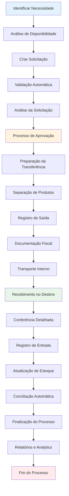
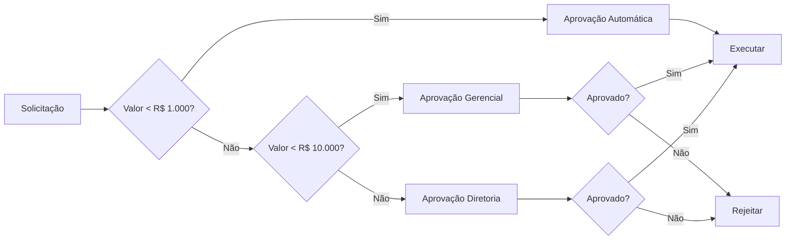

# 🔄 Fluxo de Transferência

🏠 [Home](../index.md) > 🔄 [Fluxos](index.md) > **🔄 Fluxo de Transferência**

#fluxo #transferencia #estoque #depositos #movimentacao #intermediario

---

## 🎯 Visão Geral do Fluxo

O **Fluxo de Transferência** gerencia o processo completo de transferência de produtos entre diferentes depósitos, lojas ou unidades da empresa. Este fluxo garante controle total da movimentação interna, otimização da distribuição de estoque e balanceamento inteligente entre unidades, mantendo a rastreabilidade completa de todas as movimentações.

### 🚀 **Principais Benefícios**
- **Otimização inteligente** da distribuição de estoque
- **Controle total** da movimentação interna
- **Redução significativa** de rupturas de estoque
- **Balanceamento automático** entre unidades
- **Rastreabilidade completa** de todas as movimentações
- **Integração perfeita** com módulos de vendas e estoque

### 🎯 **Resultados Esperados**
- **Redução de 70%** em rupturas de estoque
- **Otimização de 40%** na distribuição de produtos
- **Aumento de 60%** na eficiência operacional
- **Diminuição de 50%** em custos de movimentação
- **Melhoria de 80%** no controle de estoque

---

## 🔄 Visão Geral do Processo

---

## 📋 Etapas Detalhadas

### 1️⃣ **Identificação da Necessidade**
**Objetivo**: Identificar e documentar a necessidade de transferência

#### **Gatilhos Automáticos**
- **Estoque mínimo** atingido em uma unidade
- **Excesso de estoque** identificado em outra unidade
- **Sazonalidade regional** detectada pelo sistema
- **Demanda prevista** baseada em histórico
- **Solicitação manual** de filial ou departamento

#### **Análise Inteligente**
1. **Verificar disponibilidade** em todas as unidades
2. **Analisar histórico** de movimentação
3. **Considerar sazonalidade** e tendências
4. **Calcular custos** de transferência
5. **Sugerir quantidades** otimizadas

#### **Tipos de Transferência**
- **Emergencial**: Para evitar ruptura imediata
- **Programada**: Baseada em planejamento
- **Balanceamento**: Redistribuição de estoque
- **Sazonal**: Ajuste para épocas específicas
- **Estratégica**: Movimentação por decisão comercial

---

### 2️⃣ **Criação da Solicitação**
**Objetivo**: Documentar formalmente a necessidade de transferência

#### **Informações Obrigatórias**
- **Unidade origem**: Depósito/loja que enviará
- **Unidade destino**: Depósito/loja que receberá
- **Produtos**: Lista detalhada com códigos
- **Quantidades**: Quantidade solicitada por item
- **Justificativa**: Motivo da transferência
- **Prioridade**: Urgente/Normal/Baixa
- **Prazo**: Data limite para execução

#### **Validações Automáticas**
- ✅ **Disponibilidade** no estoque origem
- ✅ **Capacidade** de armazenamento no destino
- ✅ **Políticas** de transferência da empresa
- ✅ **Custos** dentro dos limites aprovados
- ✅ **Documentação** necessária disponível

#### **Cálculos Automáticos**
- **Custo total** da transferência
- **Impacto no estoque** origem e destino
- **Prazo estimado** de execução
- **Recursos necessários** para transporte
- **ROI** da transferência

---

### 3️⃣ **Processo de Aprovação**
**Objetivo**: Validar e aprovar a transferência conforme políticas

#### **Níveis de Aprovação**
1. **Aprovação Automática** (até R$ 1.000)
   - Transferências de baixo valor
   - Produtos não críticos
   - Mesmo grupo de lojas

2. **Aprovação Gerencial** (R$ 1.000 - R$ 10.000)
   - Valores médios
   - Produtos estratégicos
   - Transferências entre regiões

3. **Aprovação Diretoria** (acima de R$ 10.000)
   - Valores altos
   - Produtos críticos
   - Transferências especiais

#### **Critérios de Aprovação**
- **Valor financeiro** da transferência
- **Tipo de produto** (crítico/normal/especial)
- **Urgência** da necessidade
- **Disponibilidade** de transporte
- **Análise custo-benefício**
- **Histórico** de transferências similares

#### **Workflow de Aprovação**

---

### 4️⃣ **Preparação e Execução**
**Objetivo**: Executar fisicamente a transferência aprovada

#### **Preparação no Depósito Origem**
1. **Reservar produtos** no sistema
2. **Separar fisicamente** os itens
3. **Conferir quantidades** e qualidade
4. **Embalar adequadamente** para transporte
5. **Gerar documentação** de transferência

#### **Documentação Gerada**
- **Nota de Transferência**: Documento interno oficial
- **Lista de Produtos**: Detalhamento completo dos itens
- **Ordem de Transporte**: Instruções para logística
- **Comprovante de Saída**: Registro de origem
- **Etiquetas de Identificação**: Para rastreamento

#### **Controles de Qualidade**
- **Verificação visual** do estado dos produtos
- **Conferência dupla** das quantidades
- **Validação** da embalagem adequada
- **Checklist** de documentação completa
- **Foto** dos produtos antes do transporte

#### **Registro de Saída**
- **Baixa automática** no estoque origem
- **Registro** do responsável pela separação
- **Horário** de saída dos produtos
- **Responsável** pelo transporte
- **Previsão** de chegada no destino

---

### 5️⃣ **Transporte e Rastreamento**
**Objetivo**: Transportar produtos com segurança e rastreabilidade

#### **Modalidades de Transporte**
- **Transporte próprio**: Veículos da empresa
- **Transportadora parceira**: Terceirizada
- **Correios**: Para pequenos volumes
- **Motoboy**: Para urgências locais
- **Transporte especial**: Para produtos específicos

#### **Rastreamento em Tempo Real**
- **GPS** no veículo (quando aplicável)
- **Código de rastreamento** único
- **Atualizações** de status automáticas
- **Notificações** para origem e destino
- **Histórico** completo de movimentação

#### **Documentação de Transporte**
- **Manifesto de carga**: Lista de produtos
- **Comprovante de coleta**: Assinatura da origem
- **Seguro de transporte**: Quando necessário
- **Instruções especiais**: Cuidados específicos

---

### 6️⃣ **Recebimento e Conferência**
**Objetivo**: Receber e conferir produtos no destino

#### **Processo de Recebimento**
1. **Receber produtos** no destino
2. **Conferir documentação** de transporte
3. **Verificar integridade** da embalagem
4. **Conferir quantidades** item por item
5. **Verificar qualidade** dos produtos

#### **Conferência Detalhada**
- **Quantidade**: Conforme documentação
- **Qualidade**: Estado físico dos produtos
- **Documentação**: Completa e correta
- **Prazo**: Dentro do tempo esperado
- **Embalagem**: Adequada e íntegra

#### **Tratamento de Divergências**
- **Falta de produtos**: Registro e comunicação
- **Produtos a mais**: Verificação e devolução
- **Produtos avariados**: Protocolo de troca
- **Documentação incorreta**: Correção imediata
- **Atraso na entrega**: Registro e justificativa

#### **Registro de Entrada**
- **Entrada automática** no estoque destino
- **Registro** do responsável pelo recebimento
- **Horário** de chegada dos produtos
- **Status** da conferência (OK/Divergência)
- **Observações** relevantes

---

## 💡 Casos de Uso

### 🏪 **Caso 1: Transferência entre Lojas**
**Situação**: Loja A tem excesso de produto, Loja B tem falta

#### **Cenário Detalhado**
- **Produto**: Ração para cães 15kg
- **Loja A**: 50 unidades (excesso)
- **Loja B**: 2 unidades (estoque crítico)
- **Distância**: 25km entre lojas
- **Urgência**: Alta (cliente aguardando)

#### **Processo Executado**
1. **Sistema identifica** automaticamente a necessidade
2. **Solicitação** gerada pela Loja B
3. **Aprovação automática** (valor R$ 800)
4. **Separação** na Loja A em 30 minutos
5. **Transporte** com motoboy da empresa
6. **Recebimento** na Loja B em 2 horas

#### **Resultados**
- ✅ **Venda não perdida** na Loja B
- ✅ **Cliente satisfeito** com disponibilidade
- ✅ **Estoque balanceado** entre lojas
- ✅ **Processo eficiente** e rápido

---

### 🏭 **Caso 2: Transferência CD para Loja**
**Situação**: Reposição programada de estoque

#### **Cenário Detalhado**
- **Origem**: Centro de Distribuição
- **Destino**: Loja Shopping Center
- **Produtos**: 50 itens diversos
- **Valor**: R$ 15.000
- **Frequência**: Semanal

#### **Processo Executado**
1. **Sistema programa** transferência baseada em histórico
2. **Análise de vendas** da semana anterior
3. **Cálculo automático** das quantidades
4. **Aprovação gerencial** devido ao valor
5. **Preparação** no CD com 1 dia de antecedência
6. **Transporte** com caminhão próprio
7. **Recebimento** na loja no horário programado

#### **Resultados**
- ✅ **Estoque sempre abastecido** na loja
- ✅ **Vendas otimizadas** sem ruptura
- ✅ **Processo automatizado** e eficiente
- ✅ **Redução de custos** com planejamento

---

### 🚚 **Caso 3: Transferência Urgente**
**Situação**: Cliente VIP aguardando produto específico

#### **Cenário Detalhado**
- **Cliente**: Empresa parceira (VIP)
- **Produto**: Equipamento específico
- **Valor**: R$ 5.000
- **Prazo**: Mesmo dia
- **Disponibilidade**: Apenas em outra unidade

#### **Processo Executado**
1. **Vendedor identifica** necessidade urgente
2. **Solicitação expressa** com justificativa
3. **Aprovação gerencial** em 15 minutos
4. **Separação prioritária** na unidade origem
5. **Transporte expresso** com motorista dedicado
6. **Entrega direta** ao cliente VIP

#### **Resultados**
- ✅ **Cliente VIP atendido** no prazo
- ✅ **Relacionamento fortalecido** com parceiro
- ✅ **Venda de alto valor** realizada
- ✅ **Processo flexível** para urgências

---

## 🔧 Funcionalidades Avançadas

### 🤖 **Transferência Automática**
- **Regras inteligentes** de reposição automática
- **Estoque mínimo** como gatilho principal
- **Balanceamento automático** entre unidades
- **Otimização** de distribuição por IA
- **Previsão de demanda** baseada em histórico

### 📊 **Analytics Avançado**
- **Análise de frequência** de transferências
- **Custos detalhados** por movimentação
- **Tempo médio** de cada etapa do processo
- **Eficiência** comparativa entre unidades
- **ROI** de cada transferência

### 🔔 **Alertas e Notificações**
- **Solicitação pendente** de aprovação
- **Transferência em trânsito** - acompanhamento
- **Atraso na entrega** - alertas automáticos
- **Divergência no recebimento** - notificação imediata
- **Estoque crítico** - sugestão de transferência

### 📱 **Mobile e Mobilidade**
- **App móvel** para aprovações
- **Leitura de código** de barras
- **Assinatura digital** para recebimento
- **Fotos** de produtos e documentos
- **Notificações push** em tempo real

---

## 📊 Relatórios Disponíveis

### 📈 **Relatórios Operacionais**
1. **Transferências do Dia**: Status atual de todas as transferências
2. **Transferências por Período**: Análise temporal detalhada
3. **Transferências por Unidade**: Performance por local
4. **Produtos Mais Transferidos**: Análise de itens críticos
5. **Tempo de Processo**: Eficiência por etapa

### 📊 **Relatórios Gerenciais**
1. **Custo de Transferências**: Análise financeira completa
2. **Eficiência de Distribuição**: Otimização de estoque
3. **Balanceamento de Estoque**: Distribuição entre unidades
4. **ROI de Transferências**: Retorno sobre movimentação
5. **Previsão de Demanda**: Análise preditiva

### 📋 **Relatórios de Compliance**
1. **Auditoria de Transferências**: Rastro completo
2. **Aprovações Pendentes**: Workflow de aprovação
3. **Divergências**: Problemas e resoluções
4. **Documentação Fiscal**: Conformidade legal
5. **Controle de Qualidade**: Indicadores de processo

---

## 🔧 Configurações Necessárias

### ⚙️ **Setup Inicial**
1. **Cadastrar unidades** (lojas, depósitos, CDs)
2. **Definir hierarquia** de aprovação
3. **Configurar custos** de transferência
4. **Estabelecer prazos** por rota
5. **Definir produtos críticos** e regras especiais
6. **Configurar integrações** com transportadoras

### 🎯 **Parâmetros Importantes**
- **Limite automático**: R$ 1.000 para aprovação automática
- **Limite gerencial**: R$ 10.000 para aprovação gerencial
- **Prazo padrão**: 24h para mesma cidade
- **Prazo regional**: 48h para outras cidades
- **Estoque mínimo**: 10% do estoque máximo
- **Margem de segurança**: 20% para produtos críticos

### 🔗 **Integrações Necessárias**
- **Sistema de Estoque**: Controle de disponibilidade
- **Sistema Financeiro**: Controle de custos
- **Transportadoras**: Rastreamento e frete
- **Sistema Fiscal**: Documentação quando necessário
- **WhatsApp Business**: Notificações automáticas

---

## 💡 Dicas e Boas Práticas

### ✅ **Melhores Práticas**
1. **Planeje transferências** com antecedência
2. **Mantenha comunicação** entre unidades
3. **Documente** todas as movimentações
4. **Monitore** indicadores de performance
5. **Treine equipe** nos processos

### 🎯 **Otimização de Resultados**
- **Agrupe transferências** por destino
- **Use horários otimizados** para transporte
- **Mantenha histórico** para análise
- **Automatize** processos repetitivos
- **Monitore custos** constantemente

### ⚠️ **Cuidados Especiais**
- **Produtos frágeis**: Embalagem reforçada
- **Alto valor**: Seguro obrigatório
- **Perecíveis**: Transporte adequado
- **Controlados**: Documentação especial
- **Sazonais**: Planejamento antecipado

---

## 🚨 Pontos de Atenção

### 🔴 **Riscos Críticos**
- **Perda de produtos** durante transporte
- **Divergências** não identificadas
- **Documentação incorreta** ou incompleta
- **Atraso** impactando vendas
- **Custos excessivos** de transferência

### 🟡 **Riscos Médios**
- **Comunicação falha** entre unidades
- **Processo manual** sujeito a erros
- **Falta de rastreamento** adequado
- **Aprovações** demoradas
- **Estoque desbalanceado**

### 🟢 **Controles Preventivos**
- **Dupla conferência** obrigatória
- **Rastreamento** em tempo real
- **Aprovações** com prazo definido
- **Backup** de processos manuais
- **Auditoria** regular de processos

---

## 📚 Documentação Relacionada

### 🔗 **Módulos Integrados**
- **[Controle de Estoque](../modulos/estoque/index.md)** - Gestão de estoque
- **[Movimentação de Estoque](../modulos/estoque/movimentacao-estoque.md)** - Controle de movimentação
- **[Transferência entre Depósitos](../modulos/estoque/transferencia-depositos.md)** - Funcionalidade específica
- **[Relatórios de Estoque](../modulos/relatorios/posicao-estoque.md)** - Análises de estoque

### 🔄 **Fluxos Relacionados**
- **[Fluxo de Compras](fluxo-compras.md)** - Entrada de produtos
- **[Fluxo de Vendas](fluxo-vendas-completo.md)** - Saída de produtos
- **[Fluxo de Inventário](fluxo-inventario.md)** - Controle de estoque
- **[Fluxo de Ajustes](fluxo-ajustes.md)** - Correções de estoque

### 💡 **Casos de Uso Relacionados**
- **[Controle de Estoque](../casos-uso/comercio-geral/controle-estoque.md)** - Gestão prática
- **[Loja do Carlos](../casos-uso/comercio-geral/controle-estoque-loja.md)** - Exemplo real
- **[Empresa com Infraestrutura](../casos-uso/modulos-apoio/empresa-infraestrutura-completa.md)** - Caso complexo

---

## 🏷️ Tags
`#fluxo` `#transferencia` `#estoque` `#depositos` `#movimentacao` `#intermediario`

---

**Última atualização**: Janeiro 2025  
**Versão do documento**: 2.0  
**Responsável**: Equipe de Documentação White ERP
