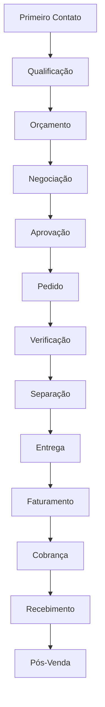

# 🔄 Fluxo de Vendas Completo

🏠 [Home](../index.md) > 🔄 [Fluxos](index.md) > **📈 Vendas Completo**

#fluxo #vendas #processo #completo #passo-a-passo

---

## 🎯 Visão Geral do Fluxo

O **Fluxo de Vendas Completo** do ERP GerenciaTech abrange todo o processo comercial, desde o **primeiro contato** com o cliente até a **entrega final** do produto ou serviço. Este fluxo é **flexível** e se adapta a diferentes tipos de negócio e situações de venda.

### 🚀 **Principais Benefícios**
- **Padronização** do processo comercial
- **Rastreabilidade** completa da venda
- **Integração automática** entre módulos
- **Redução de erros** e retrabalho
- **Melhoria** na experiência do cliente

---

## 🔄 Visão Geral do Processo



---

## 📋 Etapas Detalhadas

### 1️⃣ **Primeiro Contato**
**Objetivo**: Identificar oportunidade de venda

#### **Canais de Entrada**
- 🏪 **Presencial**: Cliente na loja
- 📞 **Telefone**: Ligação do cliente
- 📧 **Email**: Solicitação por email
- 📱 **WhatsApp**: Mensagem direta
- 🌐 **Site**: Formulário de contato
- 🛍️ **Marketplace**: Pedido online

#### **Ações Necessárias**
1. **Recepcionar** o cliente adequadamente
2. **Identificar** a necessidade
3. **Qualificar** o potencial de compra
4. **Registrar** o contato no sistema

#### **Documentação Relacionada**
- **[Cadastro de Clientes](../modulos/cadastros/cadastro-de-clientes.md)** - Como cadastrar clientes
- **[Gestão de Leads](../modulos/crm/gestao-leads.md)** - Gestão de leads

---

### 2️⃣ **Qualificação do Cliente**
**Objetivo**: Entender necessidades e perfil do cliente

#### **Informações a Coletar**
- 👤 **Dados Pessoais**: Nome, contato, empresa
- 💰 **Orçamento**: Faixa de investimento
- ⏰ **Prazo**: Quando precisa da solução
- 🎯 **Necessidades**: O que está buscando
- 🏢 **Autoridade**: Quem decide a compra

#### **Processo de Qualificação**
1. **Fazer** perguntas abertas
2. **Ouvir** atentamente as respostas
3. **Registrar** informações no sistema
4. **Classificar** o lead (quente/morno/frio)

#### **Ferramentas do Sistema**
- **[Cadastro de Clientes](../modulos/cadastros/cadastro-de-clientes.md)** - Cadastro completo
- **[Histórico de Interações](../modulos/crm/historico-interacoes.md)** - Histórico de contatos

---

### 3️⃣ **Elaboração do Orçamento**
**Objetivo**: Criar proposta comercial adequada

#### **Preparação do Orçamento**
1. **Acessar** **[Orçamentos](../modulos/vendas/orcamentos.md)**
2. **Selecionar** cliente qualificado
3. **Adicionar** produtos/serviços
4. **Configurar** condições comerciais
5. **Calcular** impostos e frete
6. **Revisar** valores e prazos

#### **Elementos do Orçamento**
- 📋 **Produtos/Serviços**: Descrição detalhada
- 💰 **Preços**: Valores unitários e totais
- 📊 **Condições**: Prazos e formas de pagamento
- 🚚 **Entrega**: Prazo e local
- ⏰ **Validade**: Prazo de validade da proposta

#### **Personalização**
- **Logo** da empresa
- **Cores** corporativas
- **Observações** específicas
- **Termos** e condições

---

### 4️⃣ **Apresentação e Negociação**
**Objetivo**: Apresentar proposta e negociar condições

#### **Formas de Apresentação**
- 🏪 **Presencial**: Na loja ou empresa do cliente
- 📧 **Email**: Envio automático pelo sistema
- 📱 **WhatsApp**: Compartilhamento direto
- 🌐 **Portal**: Acesso online pelo cliente

#### **Técnicas de Negociação**
1. **Apresentar** benefícios, não apenas características
2. **Mostrar** valor agregado
3. **Estar** preparado para objeções
4. **Oferecer** alternativas quando necessário
5. **Buscar** ganha-ganha

#### **Registro no Sistema**
- **Status** da negociação
- **Objeções** apresentadas
- **Contrapropostas** feitas
- **Próximos** passos

---

### 5️⃣ **Aprovação do Cliente**
**Objetivo**: Confirmar aceite da proposta

#### **Formas de Aprovação**
- ✅ **Verbal**: Confirmação por telefone
- 📧 **Email**: Resposta de aceite
- 📱 **WhatsApp**: Mensagem de confirmação
- 📄 **Assinatura**: Documento físico ou digital

#### **Ações no Sistema**
1. **Alterar** status do orçamento para "Aprovado"
2. **Registrar** forma de aprovação
3. **Definir** responsável pelo pedido
4. **Programar** próximas etapas

---

### 6️⃣ **Conversão em Pedido**
**Objetivo**: Transformar orçamento aprovado em pedido de venda

#### **Processo de Conversão**
1. **Acessar** orçamento aprovado
2. **Clicar** em "Converter em Pedido"
3. **Revisar** dados do pedido
4. **Confirmar** prazos de entrega
5. **Salvar** pedido gerado

#### **Informações do Pedido**
- 📋 **Número**: Numeração sequencial automática
- 📅 **Data**: Data de criação do pedido
- 🚚 **Entrega**: Prazo e endereço
- 💰 **Pagamento**: Condições confirmadas
- 👥 **Responsável**: Vendedor ou atendente

#### **Documentação**
- **[Pedidos](../modulos/vendas/pedidos.md)** - Gestão de pedidos

---

### 7️⃣ **Verificação e Preparação**
**Objetivo**: Confirmar disponibilidade e preparar o pedido

#### **Verificação de Estoque**
1. **Consultar** **[Consulta de Estoque](../modulos/estoque/consulta-estoque.md)**
2. **Confirmar** disponibilidade de todos os itens
3. **Verificar** localização dos produtos
4. **Reservar** produtos para o pedido

#### **Verificação de Crédito**
- **Consultar** limite de crédito do cliente
- **Verificar** histórico de pagamentos
- **Confirmar** condições de pagamento

#### **Preparação Interna**
- **Comunicar** equipe de separação
- **Programar** produção (se necessário)
- **Coordenar** logística de entrega

---

### 8️⃣ **Separação dos Produtos**
**Objetivo**: Preparar produtos para entrega

#### **Processo de Separação**
1. **Imprimir** lista de separação
2. **Localizar** produtos no estoque
3. **Conferir** quantidades e especificações
4. **Embalar** adequadamente
5. **Identificar** volumes

#### **Controle de Qualidade**
- **Verificar** estado dos produtos
- **Testar** funcionamento (se aplicável)
- **Conferir** acessórios e manuais
- **Documentar** não conformidades

#### **Atualização no Sistema**
- **Alterar** status para "Separado"
- **Registrar** responsável pela separação
- **Anexar** fotos se necessário
- **Programar** entrega

---

### 9️⃣ **Entrega/Retirada**
**Objetivo**: Fazer o produto chegar ao cliente

#### **Modalidades de Entrega**
- 🏪 **Retirada**: Cliente busca na loja
- 🚚 **Entrega**: Transporte próprio
- 📦 **Correios**: Envio pelos correios
- 🚛 **Transportadora**: Empresa terceirizada

#### **Processo de Entrega**
1. **Confirmar** endereço e horário
2. **Preparar** documentação
3. **Carregar** produtos no veículo
4. **Entregar** ao destinatário
5. **Obter** comprovante de entrega

#### **Documentação da Entrega**
- **Nota fiscal** de venda
- **Comprovante** de entrega
- **Manual** do produto
- **Termo** de garantia

---

### 🔟 **Faturamento**
**Objetivo**: Emitir documentos fiscais e financeiros

#### **Documentos Fiscais**
- **[Emissão de NFe](../modulos/integracoes/emissao-nfe.md)** - Nota Fiscal Eletrônica
- **[Emissão de NFCe](../modulos/integracoes/emissao-nfce.md)** - Nota Fiscal de Consumidor
- **[Emissão de NFSe](../modulos/integracoes/emissao-nfse.md)** - Nota Fiscal de Serviços

#### **Processo de Faturamento**
1. **Confirmar** entrega realizada
2. **Emitir** nota fiscal
3. **Transmitir** para SEFAZ
4. **Enviar** para o cliente
5. **Arquivar** documentos

#### **Integração Financeira**
- **Gerar** títulos a receber
- **Enviar** boletos (se aplicável)
- **Configurar** lembretes de cobrança

---

### 1️⃣1️⃣ **Cobrança**
**Objetivo**: Gerenciar recebimento dos valores

#### **Formas de Cobrança**
- 💰 **À Vista**: Pagamento imediato
- 📄 **Boleto**: Cobrança bancária
- 💳 **Cartão**: Débito ou crédito
- 📱 **PIX**: Transferência instantânea

#### **Processo de Cobrança**
1. **Acompanhar** vencimentos
2. **Enviar** lembretes
3. **Fazer** cobranças ativas
4. **Negociar** quando necessário
5. **Registrar** acordos

#### **Documentação**
- **[Contas a Receber](../modulos/financeiro/contas-a-receber.md)** - Gestão de recebimentos
- **[Cobrança](../modulos/financeiro/cobranca.md)** - Processo de cobrança

---

### 1️⃣2️⃣ **Recebimento**
**Objetivo**: Confirmar pagamento e baixar títulos

#### **Processo de Recebimento**
1. **Identificar** pagamento
2. **Conferir** valor e data
3. **Baixar** título no sistema
4. **Conciliar** com extrato bancário
5. **Atualizar** situação do cliente

#### **Formas de Confirmação**
- 🏦 **Extrato bancário**
- 📱 **Notificação PIX**
- 💳 **Comprovante cartão**
- 📄 **Comprovante boleto**

---

### 1️⃣3️⃣ **Pós-Venda**
**Objetivo**: Garantir satisfação e fidelização

#### **Ações de Pós-Venda**
- 📞 **Pesquisa** de satisfação
- 🛠️ **Suporte** técnico
- 📧 **Newsletter** com dicas
- 🎁 **Ofertas** especiais

#### **Oportunidades**
- 🔄 **Venda cruzada**: Produtos complementares
- ⬆️ **Upgrade**: Versões superiores
- 🔁 **Recompra**: Produtos recorrentes
- 👥 **Indicação**: Novos clientes

---

## 🎯 Variações do Fluxo

### ⚡ **Venda Rápida (PDV)**
```
Cliente → Produtos → Pagamento → Cupom → Entrega
```
**Tempo**: 2-5 minutos  
**Ideal para**: Comércio varejista

### 📋 **Venda Consultiva**
```
Lead → Qualificação → Orçamento → Negociação → Pedido → Entrega
```
**Tempo**: 1-30 dias  
**Ideal para**: Vendas B2B, produtos complexos

### 🔧 **Prestação de Serviços**
```
Solicitação → Orçamento → OS → Execução → Entrega → Faturamento
```
**Tempo**: Variável  
**Ideal para**: Serviços técnicos

---

## 📊 Métricas e Controles

### 📈 **KPIs do Funil de Vendas**
- **Taxa de Conversão**: Lead → Orçamento → Venda
- **Tempo Médio**: Duração de cada etapa
- **Ticket Médio**: Valor médio das vendas
- **Margem de Lucro**: Rentabilidade por venda

### 🎯 **Pontos de Controle**
- **Qualificação**: % de leads qualificados
- **Orçamento**: Tempo para envio
- **Negociação**: Taxa de aprovação
- **Entrega**: Prazo médio de entrega
- **Recebimento**: Inadimplência

---

## 🔧 Automações Disponíveis

### 🤖 **Automações do Sistema**
- **Baixa de estoque** automática
- **Emissão fiscal** automática
- **Geração de títulos** a receber
- **Envio de boletos** por email
- **Lembretes** de cobrança

### 📱 **Integrações**
- **WhatsApp**: Notificações automáticas
- **Email**: Confirmações e lembretes
- **Transportadoras**: Rastreamento
- **Bancos**: Conciliação automática

---

## 🆘 Problemas Comuns e Soluções

### ❌ **Orçamento Não Aprovado**
**Causas Possíveis**:
- Preço alto demais
- Prazo inadequado
- Falta de confiança
- Concorrência

**Soluções**:
- Revisar precificação
- Oferecer condições especiais
- Melhorar apresentação
- Acompanhar mais de perto

### ❌ **Atraso na Entrega**
**Causas Possíveis**:
- Falta de estoque
- Problema logístico
- Falha na comunicação
- Problema com fornecedor

**Soluções**:
- Melhorar controle de estoque
- Ter fornecedores alternativos
- Comunicar proativamente
- Criar buffer de segurança

### ❌ **Inadimplência**
**Causas Possíveis**:
- Análise de crédito inadequada
- Falta de acompanhamento
- Problemas do cliente
- Produto com defeito

**Soluções**:
- Melhorar análise de crédito
- Acompanhar vencimentos
- Negociar rapidamente
- Garantir qualidade

---

## 🔄 Melhorias Contínuas

### 📊 **Análise de Performance**
- **Revisar** métricas mensalmente
- **Identificar** gargalos
- **Implementar** melhorias
- **Treinar** equipe

### 🎯 **Otimizações**
- **Reduzir** tempo de resposta
- **Melhorar** taxa de conversão
- **Aumentar** ticket médio
- **Diminuir** inadimplência

---

## 📚 Documentação Relacionada

### 🔗 **Módulos Envolvidos**
- **[Gestão de Vendas](../modulos/vendas/index.md)** - Gestão de vendas
- **[Gestão de Cadastros](../modulos/cadastros/index.md)** - Cadastros base
- **[Controle de Estoque](../modulos/estoque/index.md)** - Controle de estoque
- **[Gestão Financeira](../modulos/financeiro/index.md)** - Gestão financeira

### 📋 **Outros Fluxos**
- **[Fluxo Compras](fluxo-compras.md)** - Reposição de estoque
- **[Fluxo Contratos](fluxo-contratos.md)** - Faturamento recorrente
- **[Fluxo Fiscal](fluxo-fiscal.md)** - Emissão de documentos

### 💡 **Casos de Uso**
- **[Venda Completa](../casos-uso/comercio-geral/venda-completa.md)** - Venda completa
- **[Venda com Serviço](../casos-uso/servicos/venda-com-servico.md)** - Venda + serviço
- **[Projeto Completo](../casos-uso/servicos/projeto-completo.md)** - Projeto completo

---

## 📋 Checklist do Fluxo

### ✅ **Preparação**
- [ ] Clientes cadastrados
- [ ] Produtos com preços atualizados
- [ ] Estoque conferido
- [ ] Equipe treinada

### ✅ **Durante o Processo**
- [ ] Qualificar bem o cliente
- [ ] Orçamento detalhado
- [ ] Negociação documentada
- [ ] Aprovação registrada

### ✅ **Finalização**
- [ ] Entrega confirmada
- [ ] Documentos emitidos
- [ ] Cobrança programada
- [ ] Pós-venda planejado

---

**💡 Dica Final**: O fluxo de vendas é o processo mais importante do seu negócio. Dedique tempo para entendê-lo, otimizá-lo e treinar sua equipe. Cada etapa bem executada aumenta significativamente suas chances de sucesso!

---

**Tags relacionadas**: #fluxo #vendas #processo #completo #passo-a-passo #comercial #gestao 