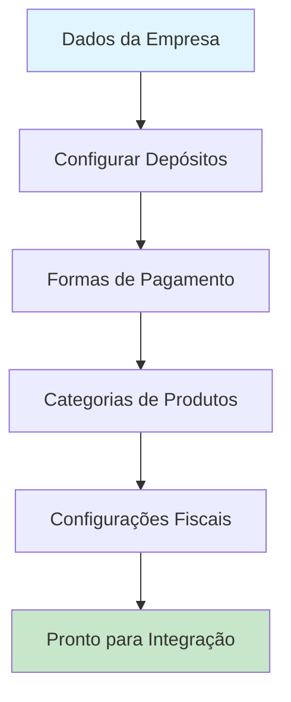
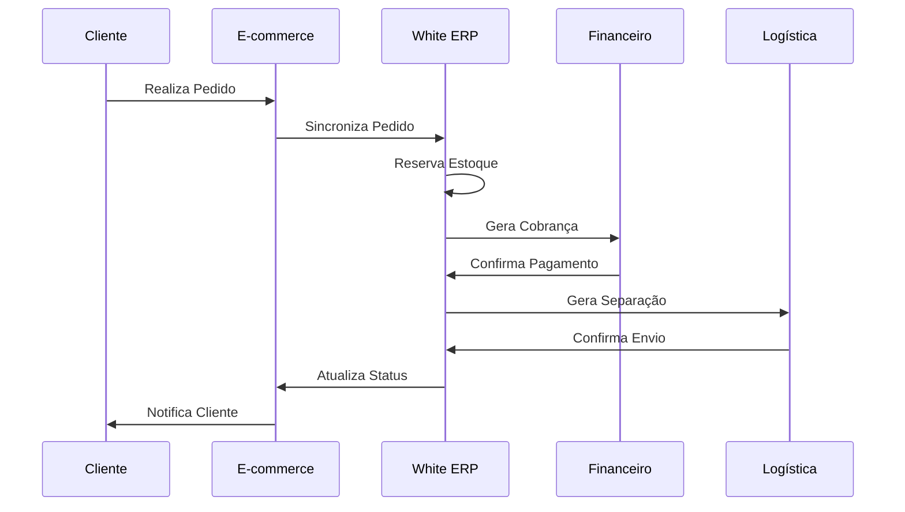

# 🌐 Integração com E-commerce

🏠 [Home](../index.md) > 📚 [Guias](index.md) > **Integração com E-commerce**

#integracao #ecommerce #omnichannel #marketplace #avancado #passo-a-passo

---

## 🎯 Visão Geral do Guia

Este guia completo ensina como **integrar seu White ERP com plataformas de e-commerce**, criando uma **operação omnichannel** que unifica sua loja física e online. Você aprenderá desde a configuração básica até estratégias avançadas de sincronização e gestão.

### 📋 O que você aprenderá:
- ✅ Configuração de integrações com marketplaces
- ✅ Sincronização automática de produtos e estoque
- ✅ Gestão unificada de pedidos online e offline
- ✅ Controle de preços e promoções
- ✅ Logística integrada e rastreamento
- ✅ Relatórios omnichannel
- ✅ Automação de processos de venda

**⏱️ Tempo estimado**: 5-7 dias (2-3 horas por dia)  
**🎯 Nível**: Avançado  
**📋 Pré-requisitos**: Experiência avançada no White ERP, conhecimento em vendas e estoque

---

## 🚀 Dia 1: Preparação e Configuração Inicial

### 📋 Configurações Essenciais

#### 🔧 1. Configuração da Empresa para E-commerce
1. Acesse **Configurações** > **Dados da Empresa**
2. Configure os dados específicos para e-commerce:
   - **CNPJ** e **Inscrição Estadual** atualizados
   - **Endereço de origem** para cálculo de frete
   - **Dados de contato** para marketplace
   - **Logotipo** em alta resolução

> **💡 Dica**: Mantenha sempre atualizados os dados da empresa, pois eles serão sincronizados automaticamente com as plataformas.

#### 🏪 2. Configuração de Depósitos
1. Acesse **Estoque** > **Configurações** > **Depósitos**
2. Configure depósitos específicos:
   - **Depósito E-commerce**: Para produtos exclusivos online
   - **Depósito Omnichannel**: Para produtos compartilhados
   - **Depósito Reserva**: Para estoque de segurança

#### 💰 3. Configuração de Formas de Pagamento
1. Acesse **Financeiro** > **Formas de Pagamento**
2. Configure as formas aceitas no e-commerce:
   - **PIX** (integração automática)
   - **Cartão de Crédito** (via gateway)
   - **Cartão de Débito**
   - **Boleto Bancário**
   - **Transferência Bancária**

### 🔄 Fluxo de Configuração Inicial



---

## 🛒 Dia 2: Configuração de Produtos para E-commerce

### 📦 Preparação do Catálogo

#### 🏷️ 1. Categorização de Produtos
1. Acesse **Cadastros** > **Produtos** > **Categorias**
2. Crie categorias específicas para e-commerce:
   - **Estrutura hierárquica** (Categoria > Subcategoria)
   - **Palavras-chave** para SEO
   - **Descrições otimizadas**

#### 📸 2. Configuração de Imagens
1. No cadastro de produtos, configure:
   - **Imagem principal** (mínimo 800x800px)
   - **Imagens secundárias** (múltiplos ângulos)
   - **Imagens de variações** (cores, tamanhos)
   - **Formato**: JPG ou PNG
   - **Tamanho máximo**: 2MB por imagem

> **⚠️ Atenção**: Imagens de qualidade são essenciais para conversão em e-commerce. Invista em fotos profissionais.

#### 📝 3. Descrições e Especificações
1. Para cada produto, configure:
   - **Título otimizado** (máximo 60 caracteres)
   - **Descrição curta** (resumo de 160 caracteres)
   - **Descrição completa** (detalhada, com benefícios)
   - **Especificações técnicas**
   - **Palavras-chave** para busca

### 💡 Exemplo Prático: Produto Otimizado

```markdown
Produto: Ração Premium para Cães Adultos

Título: Ração Premium Cães Adultos 15kg - Sabor Frango
Descrição Curta: Ração super premium com frango real, ideal para cães adultos de todas as raças. Rico em proteínas e vitaminas.

Especificações:
- Peso: 15kg
- Sabor: Frango
- Idade: Cães adultos (1-7 anos)
- Proteína: 26% mínimo
- Gordura: 15% mínimo
- Fibra: 4% máximo
```

---

## 🔗 Dia 3: Configuração de Integrações

### 🌐 Principais Plataformas Suportadas

#### 🛍️ 1. Mercado Livre
1. Acesse **Integrações** > **E-commerce** > **Mercado Livre**
2. Configure a integração:
   - **Token de acesso** (obtido no painel do ML)
   - **Categoria padrão** para produtos
   - **Frete configurado** (ME1, ME2, etc.)
   - **Tempo de processamento**

#### 🏪 2. Shopify
1. Acesse **Integrações** > **E-commerce** > **Shopify**
2. Configure:
   - **URL da loja** (exemplo.myshopify.com)
   - **API Key** e **Password**
   - **Webhook Secret**
   - **Localização do estoque**

#### 📱 3. Magento
1. Acesse **Integrações** > **E-commerce** > **Magento**
2. Configure:
   - **URL da API** (rest/V1/)
   - **Token de acesso**
   - **Store ID**
   - **Mapeamento de atributos**

### 🔄 Configuração de Sincronização

#### ⚙️ 1. Produtos
```markdown
Configurações de Sincronização:
- Frequência: A cada 15 minutos
- Campos sincronizados:
  ✅ Nome do produto
  ✅ Descrição
  ✅ Preço
  ✅ Estoque
  ✅ Imagens
  ✅ Categorias
  ✅ Especificações
```

#### 📦 2. Estoque
```markdown
Regras de Estoque:
- Estoque mínimo: 5 unidades
- Estoque de segurança: 10 unidades
- Atualização: Tempo real
- Reserva automática: Ativada
```

---

## 📊 Dia 4: Gestão de Pedidos e Sincronização

### 🛒 Fluxo de Pedidos E-commerce



### 📋 Gestão de Pedidos

#### 🔄 1. Sincronização Automática
1. Acesse **Vendas** > **Pedidos E-commerce**
2. Configure:
   - **Sincronização automática**: Ativada
   - **Intervalo**: 5 minutos
   - **Status inicial**: "Aguardando Pagamento"
   - **Reserva de estoque**: Automática

#### 📦 2. Processamento de Pedidos
1. **Pedidos Pagos**:
   - Status: "Pago" → "Em Separação"
   - Gera **Nota Fiscal** automaticamente
   - Reserva estoque definitivamente
   - Envia para **Logística**

2. **Pedidos Cancelados**:
   - Libera estoque automaticamente
   - Notifica plataforma de origem
   - Gera relatório de cancelamento

#### 🚚 3. Integração com Transportadoras
1. Configure as transportadoras:
   - **Correios** (PAC, SEDEX)
   - **Transportadoras privadas**
   - **Entrega própria**
   - **Retirada na loja**

### 💡 Exemplo: Processamento de Pedido

```markdown
Pedido #ML-123456789
- Cliente: João Silva
- Plataforma: Mercado Livre
- Produtos: Ração Premium 15kg (2 unidades)
- Valor: R$ 189,90
- Frete: R$ 15,00
- Status: Pago → Em Separação → Enviado → Entregue
```

---

## 💰 Dia 5: Gestão de Preços e Promoções

### 🏷️ Estratégias de Precificação

#### 📊 1. Precificação Dinâmica
1. Acesse **Vendas** > **Configurações** > **Preços E-commerce**
2. Configure regras por plataforma:
   - **Margem mínima**: 15%
   - **Margem padrão**: 25%
   - **Margem premium**: 35%
   - **Desconto máximo**: 20%

#### 🎯 2. Preços por Marketplace
```markdown
Estratégia de Preços:
- Mercado Livre: Preço competitivo (-5% vs concorrência)
- Shopify: Preço premium (+10% vs ML)
- Loja Física: Preço base
- Atacado: Desconto escalonado
```

### 🎉 Configuração de Promoções

#### 🔥 1. Promoções Automáticas
1. Acesse **Vendas** > **Promoções** > **E-commerce**
2. Configure tipos de promoção:
   - **Desconto percentual**
   - **Desconto fixo**
   - **Frete grátis**
   - **Compre X, leve Y**
   - **Cashback**

#### 📅 2. Campanhas Sazonais
```markdown
Exemplos de Campanhas:
- Black Friday: 40% desconto
- Dia das Mães: Frete grátis
- Liquidação: Desconto progressivo
- Volta às Aulas: Kit promocional
```

---

## 📈 Dia 6: Relatórios e Análises Omnichannel

### 📊 Dashboards Integrados

#### 🎯 1. Visão Geral de Vendas
1. Acesse **Relatórios** > **E-commerce** > **Dashboard**
2. Métricas principais:
   - **Vendas por canal**
   - **Conversão por plataforma**
   - **Ticket médio**
   - **Produtos mais vendidos**
   - **Regiões de maior venda**

#### 📦 2. Relatórios de Estoque
```markdown
Relatórios Disponíveis:
- Estoque por canal de venda
- Produtos em falta
- Giro de estoque omnichannel
- Previsão de reposição
- Análise ABC por canal
```

### 📱 Relatórios Mobile

#### 📊 1. App White ERP
- **Vendas em tempo real**
- **Alertas de estoque baixo**
- **Pedidos pendentes**
- **Faturamento diário**

### 💡 Exemplo: Dashboard Omnichannel

```markdown
Resumo do Dia - 15/01/2025
┌─────────────────────────────────────┐
│ Canal        │ Vendas  │ Pedidos    │
├─────────────────────────────────────┤
│ Loja Física  │ R$ 2.450│ 18 pedidos │
│ Mercado Livre│ R$ 1.890│ 12 pedidos │
│ Shopify      │ R$ 1.250│ 8 pedidos  │
│ WhatsApp     │ R$ 680  │ 5 pedidos  │
├─────────────────────────────────────┤
│ Total        │ R$ 6.270│ 43 pedidos │
└─────────────────────────────────────┘
```

---

## 🤖 Dia 7: Automação e Otimização

### ⚡ Automações Essenciais

#### 🔄 1. Workflows Automáticos
1. Configure automações:
   - **Atualização de estoque**: Tempo real
   - **Processamento de pedidos**: Automático
   - **Emissão de NFe**: Automática
   - **Envio de tracking**: Automático
   - **Feedback de entrega**: Automático

#### 📧 2. Comunicação Automatizada
```markdown
E-mails Automáticos:
- Confirmação de pedido
- Pagamento aprovado
- Produto em separação
- Pedido enviado (com tracking)
- Produto entregue
- Solicitação de avaliação
```

### 🎯 Otimizações Avançadas

#### 🚀 1. Performance
- **Cache de produtos**: Ativado
- **Compressão de imagens**: Automática
- **CDN**: Configurado
- **Sincronização otimizada**: Apenas mudanças

#### 📊 2. Análise de Dados
```markdown
Métricas de Otimização:
- Taxa de conversão por canal
- Tempo de processamento
- Satisfação do cliente
- Retorno sobre investimento
- Custo de aquisição
```

---

## 🔧 Configurações Avançadas

### 🌐 Integrações Customizadas

#### 🔗 1. APIs Personalizadas
1. Acesse **Integrações** > **APIs** > **Customizadas**
2. Configure:
   - **Endpoints personalizados**
   - **Autenticação OAuth**
   - **Mapeamento de campos**
   - **Transformação de dados**

#### 🛠️ 2. Webhooks
```markdown
Webhooks Configurados:
- Atualização de produto
- Mudança de estoque
- Novo pedido
- Alteração de status
- Cancelamento
```

### 📱 Integração com Redes Sociais

#### 📲 1. WhatsApp Business
- **Catálogo sincronizado**
- **Pedidos via WhatsApp**
- **Pagamento integrado**
- **Atendimento automatizado**

#### 📘 2. Facebook Shop
- **Produtos sincronizados**
- **Pixel de conversão**
- **Campanhas integradas**
- **Relatórios unificados**

---

## 🚨 Troubleshooting e Boas Práticas

### ⚠️ Problemas Comuns

#### 🔧 1. Sincronização de Estoque
**Problema**: Estoque divergente entre canais
**Solução**:
1. Verifique conexão com APIs
2. Confirme configurações de depósito
3. Execute sincronização manual
4. Monitore logs de erro

#### 📦 2. Pedidos Duplicados
**Problema**: Mesmo pedido aparece múltiplas vezes
**Solução**:
1. Configure **ID único** por plataforma
2. Ative **validação de duplicatas**
3. Monitore webhooks
4. Configure timeout adequado

### 💡 Boas Práticas

#### ✅ 1. Gestão de Estoque
- Mantenha **estoque de segurança**
- Configure **alertas de estoque baixo**
- Use **previsão de demanda**
- Monitore **giro de produtos**

#### 📊 2. Análise de Performance
- Acompanhe **métricas diárias**
- Analise **tendências de venda**
- Monitore **satisfação do cliente**
- Otimize **processos continuamente**

---

## 📚 Casos de Uso Práticos

### 🏪 Caso 1: Loja de Roupas Omnichannel

**Cenário**: Loja física expandindo para online

**Configuração**:
- **Depósito único** para ambos canais
- **Reserva automática** de estoque
- **Preços diferenciados** por canal
- **Promoções exclusivas** online

**Resultados**:
- ✅ Aumento de 150% nas vendas
- ✅ Redução de 30% no estoque parado
- ✅ Melhoria na experiência do cliente

### 🐕 Caso 2: Petshop com Delivery

**Cenário**: Petshop com entrega rápida

**Configuração**:
- **Integração com WhatsApp**
- **Catálogo mobile otimizado**
- **Entrega própria** configurada
- **Pagamento via PIX**

**Resultados**:
- ✅ 80% dos pedidos via WhatsApp
- ✅ Entrega em 2 horas
- ✅ Fidelização de clientes

---

## 🎯 Próximos Passos

### 📈 Expansão da Operação

#### 🌟 1. Novos Canais
- **Amazon**: Marketplace B2B
- **Instagram Shopping**: Vendas sociais
- **Google Shopping**: Anúncios integrados
- **Aplicativo próprio**: Experiência exclusiva

#### 🚀 2. Funcionalidades Avançadas
- **Inteligência artificial**: Recomendações
- **Realidade aumentada**: Experimentação virtual
- **Chatbots**: Atendimento 24/7
- **Análise preditiva**: Previsão de vendas

### 📊 Métricas de Sucesso

```markdown
Indicadores de Performance:
- Vendas omnichannel: +200%
- Satisfação do cliente: 95%+
- Tempo de processamento: <2 horas
- Taxa de conversão: 3.5%+
- Ticket médio: +25%
```

---

## 📚 Documentação Relacionada

### 🔗 Módulos Relacionados
- **[Vendas](../modulos/vendas/index.md)** - Gestão de vendas
- **[Estoque](../modulos/estoque/index.md)** - Controle de estoque
- **[Financeiro](../modulos/financeiro/index.md)** - Gestão financeira
- **[Integracoes](../modulos/integracoes/index.md)** - Configurações de integração

### 📋 Fluxos Relacionados
- **[Fluxo de Vendas](../fluxos/fluxo-vendas-completo.md)** - Processo completo
- **[Fluxo Financeiro](../fluxos/fluxo-financeiro.md)** - Gestão financeira
- **[Fluxo de Entrega](../fluxos/fluxo-entrega.md)** - Logística

### 🎯 Casos de Uso
- **[Comércio Geral](../casos-uso/comercio-geral/index.md)** - Varejo
- **[Prestação de Serviços](../casos-uso/prestacao-servicos/index.md)** - Serviços

---

## 🏷️ Tags
`#integracao` `#ecommerce` `#omnichannel` `#marketplace` `#avancado` `#automacao` `#vendas` `#estoque` `#sincronizacao`

---

**Última atualização**: Janeiro 2025  
**Versão do documento**: 1.0  
**Responsável**: Equipe de Integração White ERP 