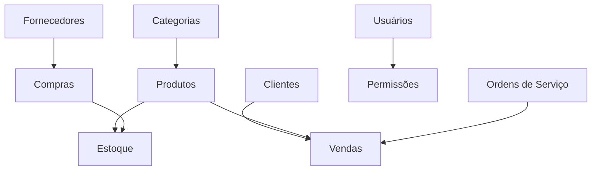

# 👥 Módulo: Gestão de Cadastros

🏠 [Home](../../index.md) > 📋 [Módulos](../index.md) > **👥 Cadastros**

#cadastros #base #fundamental #passo-a-passo

---

## 🎯 Visão Geral do Módulo

O **Módulo de Cadastros** é a **base fundamental** do ERP GerenciaTec. Aqui você registra todas as informações essenciais que alimentam os demais módulos do sistema. É como a **fundação** de uma casa - tudo depende de cadastros bem feitos e organizados.

### 🚀 **Por que os Cadastros são Importantes?**
- **Base de dados confiável** para todas as operações
- **Agilidade** nas vendas e atendimento
- **Relatórios precisos** e análises corretas
- **Integração perfeita** entre módulos
- **Compliance fiscal** e tributário

---

## 📋 Cadastros Principais

### 👤 **[[cadastro-de-clientes]]** - Gestão de Clientes
**Essencial para vendas** - Cadastre e gerencie seus clientes

**Principais funcionalidades:**
- 👥 Pessoa Física e Jurídica
- 📱 Dados de contato completos
- 💰 Limite de crédito e categoria
- 📍 Múltiplos endereços
- 📊 Histórico de compras
- 🔗 Relacionamentos familiares

**Casos de uso:**
- Cliente eventual no PDV
- Cliente VIP com desconto especial
- Cliente corporativo B2B
- Cliente inadimplente

**Tags**: `#cadastros #clientes #pessoa-fisica #pessoa-juridica #credito`

---

### 🏭 **[[cadastro-de-fornecedores]]** - Gestão de Fornecedores
**Essencial para compras** - Organize sua cadeia de suprimentos

**Principais funcionalidades:**
- 🏢 Dados comerciais e fiscais
- 💰 Condições de pagamento
- 📦 Catálogo de produtos
- 📊 Histórico de compras
- 🔄 Conversão fornecedor ↔ cliente
- 📋 Códigos de referência

**Casos de uso:**
- Fornecedor principal de ração
- Fornecedor eventual de material
- Representante comercial
- Distribuidor exclusivo

**Tags**: `#cadastros #fornecedores #compras #comercial #b2b`

---

### 📦 **[[cadastro-de-produtos]]** - Produtos e Serviços
**Coração do sistema** - Seu catálogo completo

**Principais funcionalidades:**
- 📋 Produtos físicos e serviços
- 🏷️ Códigos de barras e SKU
- 💰 Preços e margens
- 📊 Controle de estoque
- 🏷️ Categorias e grupos
- 📸 Imagens e descrições
- 📄 Informações fiscais (NCM, CFOP, CST)

**Casos de uso:**
- Produto simples com estoque
- Serviço sem estoque
- Kit/composição de produtos
- Produto com variações

**Tags**: `#cadastros #produtos #servicos #estoque #fiscal #preco`

---

### 🏷️ **[[categorias-e-grupos]]** - Organização do Catálogo
**Organização inteligente** - Estruture seu catálogo

**Principais funcionalidades:**
- 📂 Categorias hierárquicas
- 🏷️ Grupos de produtos
- 🎯 Segmentação por tipo
- 📊 Relatórios por categoria
- 🔍 Busca otimizada
- 💰 Preços por categoria

**Exemplos por segmento:**
- **Comércio Especializado**: Equipamentos → Industriais → Manutenção → Premium
- **Comércio**: Eletrônicos → Smartphones → Android
- **Serviços**: Manutenção → Preventiva → Mensal

**Tags**: `#cadastros #categorias #organizacao #estrutura`

---

## 🎯 Cadastros Especializados

### 🔧 **[[cadastro-de-ordens-servico]]** - Para Prestadores de Serviços
**Especializado para serviços** - Gestão completa de ordens de serviço

**Principais funcionalidades:**
- 🔧 Tipo de serviço e categoria
- 👤 Vínculo com cliente
- 📅 Data de abertura e prazo
- 📋 Descrição detalhada do problema
- 🔧 Materiais utilizados
- 📸 Fotos do serviço
- ✅ Histórico de execução

**Tags**: `#servicos #ordens #execucao #materiais #especifico`

---

### 🔧 **[[cadastro-de-servicos]]** - Prestação de Serviços
**Para empresas de serviços** - Catálogo de serviços

**Principais funcionalidades:**
- ⏱️ Tempo estimado de execução
- 👥 Profissionais responsáveis
- 🔧 Materiais necessários
- 💰 Precificação por complexidade
- 📋 Checklist de execução
- 📊 Margem de lucro

**Tags**: `#servicos #prestacao #tempo #materiais #profissionais`

---

### 👥 **[[cadastro-de-usuarios]]** - Gestão de Equipe
**Controle de acesso** - Gerencie sua equipe

**Principais funcionalidades:**
- 👤 Dados pessoais e funcionais
- 🔐 Perfis e permissões
- 💰 Configuração de comissões
- 📊 Metas e objetivos
- 📱 Acesso mobile
- 📈 Relatórios de performance

**Perfis padrão:**
- 👑 Administrador (acesso total)
- 👔 Gerente (gestão operacional)
- 💼 Vendedor (vendas e clientes)
- 💰 Financeiro (contas e cobranças)
- 📦 Estoque (produtos e compras)

**Tags**: `#usuarios #permissoes #equipe #seguranca #acesso`

---

## 🔄 Fluxos de Cadastro

### 📋 **Sequência Recomendada de Implementação**

#### **1️⃣ Configuração Inicial (Dia 1)**
1. **[[cadastro-de-usuarios]]** - Configure sua equipe
2. **[[categorias-e-grupos]]** - Organize a estrutura
3. **Dados da empresa** - Configure informações básicas

#### **2️⃣ Cadastros Base (Dias 2-3)**
1. **[[cadastro-de-fornecedores]]** - Principais fornecedores
2. **[[cadastro-de-produtos]]** - Produtos principais
3. **[[cadastro-de-clientes]]** - Clientes VIP

#### **3️⃣ Cadastros Especializados (Dias 4-5)**
1. **[[cadastro-de-ordens-servico]]** - Se prestar serviços
2. **[[cadastro-de-servicos]]** - Se prestar serviços
3. **Refinamento** dos cadastros existentes

---

## 💡 Dicas de Melhores Práticas

### ✅ **Cadastro de Qualidade**
1. **Padronize** nomenclaturas e códigos
2. **Mantenha** dados sempre atualizados
3. **Use** categorias consistentes
4. **Aproveite** integrações automáticas
5. **Faça** limpeza periódica

### 🚀 **Otimização de Performance**
1. **Configure** códigos de barras sempre
2. **Use** busca rápida por código
3. **Organize** por frequência de uso
4. **Mantenha** fotos em boa qualidade
5. **Ative** sugestões automáticas

### 🔒 **Segurança de Dados**
1. **Controle** acesso por perfil
2. **Faça** backup regular
3. **Valide** CPF/CNPJ sempre
4. **Proteja** dados sensíveis
5. **Monitore** alterações importantes

---

## 📊 Relatórios de Cadastros

### 📈 **Relatórios Disponíveis**
- **Clientes Ativos**: Clientes com movimento
- **Produtos em Falta**: Estoque zerado
- **Fornecedores por Volume**: Ranking de compras
- **Categorias Mais Vendidas**: Performance por grupo
- **Usuários Ativos**: Log de acessos

### 📋 **Análises Recomendadas**
- **Base de clientes**: Crescimento mensal
- **Catálogo**: Produtos sem movimento
- **Fornecedores**: Dependência por fornecedor
- **Qualidade**: Dados incompletos

---

## 🔗 Integrações dos Cadastros

### 🤝 **Como os Cadastros se Conectam**

### 🔄 **Fluxos Automáticos**
- **Cliente** → **Venda** → **Financeiro**
- **Produto** → **Estoque** → **Compra** → **Fornecedor**
- **Serviço** → **Agenda** → **Ordem de Serviço**
- **Ordem de Serviço** → **Histórico** → **Próximo Agendamento**

---

## 🆘 Problemas Comuns e Soluções

### ❌ **Produto Não Aparece na Venda**
**Possíveis causas:**
- Produto inativo
- Sem preço cadastrado
- Categoria desabilitada
- Estoque zerado (se configurado)

**Soluções:**
1. Verificar status do produto
2. Conferir preço de venda
3. Ativar categoria
4. Ajustar configuração de estoque

### ❌ **Cliente com CPF Duplicado**
**Possíveis causas:**
- Cadastro duplo
- Erro de digitação
- Cliente e fornecedor

**Soluções:**
1. Buscar registros existentes
2. Unificar cadastros
3. Converter em cliente/fornecedor
4. Validar documento

### ❌ **Código de Barras Não Funciona**
**Possíveis causas:**
- Código incorreto
- Produto inativo
- Leitor descalibrado

**Soluções:**
1. Verificar código no produto
2. Ativar produto
3. Testar leitor
4. Recadastrar código

---

## 🎯 Próximos Passos

### 📚 **Para Iniciantes**
1. **Comece** com **[[cadastro-de-produtos]]**
2. **Cadastre** alguns **[[cadastro-de-clientes]]**
3. **Organize** com **[[categorias-e-grupos]]**
4. **Configure** **[[cadastro-de-usuarios]]**

### 🚀 **Para Usuários Avançados**
1. **Otimize** estrutura de categorias
2. **Implemente** códigos padronizados
3. **Configure** integrações automáticas
4. **Analise** relatórios de qualidade

### 🎯 **Para Especialistas**
1. **Automatize** processos de cadastro
2. **Integre** com sistemas externos
3. **Desenvolva** regras de negócio
4. **Monitore** performance dos cadastros

---

## 📚 Documentação Relacionada

### 🔗 **Módulos que Dependem de Cadastros**
- **[[../vendas/index]]** - Usa clientes e produtos
- **[[../estoque/index]]** - Usa produtos e fornecedores
- **[[../financeiro/index]]** - Usa clientes e fornecedores
- **[[../relatorios/index]]** - Analisa todos os cadastros

### 📋 **Fluxos Relacionados**
- **[[../../fluxos/fluxo-vendas-completo]]** - Depende de cadastros
- **[[../../fluxos/fluxo-compras]]** - Usa fornecedores e produtos
- **[[../../fluxos/fluxo-onboarding]]** - Setup inicial

### 💡 **Casos de Uso**
- **[[../../casos-uso/comercio-geral/setup-inicial]]** - Primeiros cadastros
- **[[../../casos-uso/petshop/cadastro-animal]]** - Cadastro especializado
- **[[../../casos-uso/servicos/cadastro-cliente-servico]]** - B2B

---

## 📋 Checklist de Cadastros

### ✅ **Configuração Inicial**
- [ ] Usuários e permissões configurados
- [ ] Categorias principais criadas
- [ ] Dados da empresa atualizados
- [ ] Perfis de acesso definidos

### ✅ **Cadastros Obrigatórios**
- [ ] Pelo menos 10 produtos principais
- [ ] 3-5 fornecedores principais
- [ ] 5-10 clientes frequentes
- [ ] Serviços oferecidos (se aplicável)

### ✅ **Qualidade dos Dados**
- [ ] Códigos de barras funcionando
- [ ] Preços atualizados
- [ ] Fotos dos produtos
- [ ] Dados fiscais corretos
- [ ] Contatos validados

### ✅ **Testes de Integração**
- [ ] Produtos aparecem no PDV
- [ ] Clientes são encontrados rapidamente
- [ ] Relatórios geram corretamente
- [ ] Integrações funcionando

---

**💡 Dica Final**: Os cadastros são a base de tudo! Dedique tempo para fazê-los bem desde o início. Um cadastro bem feito economiza horas de trabalho no futuro e garante que o sistema funcione perfeitamente.

---

**Tags relacionadas**: #cadastros #base #fundamental #passo-a-passo #clientes #produtos #fornecedores #organizacao 