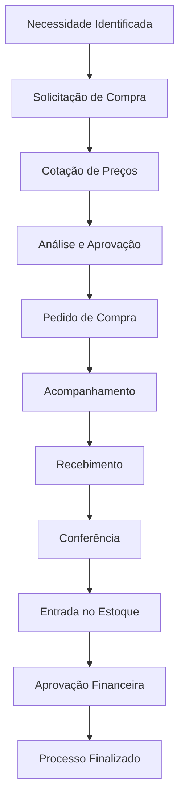

# 🛒 Módulo: Gestão de Compras

🏠 [Home](../../index.md) > 📋 [Módulos](../index.md) > **Gestão de Compras**

#compras #modulo #intermediario #gestao

---

## 📋 O que é

O módulo de **Gestão de Compras** é responsável por centralizar e automatizar todo o processo de aquisição de produtos e serviços da empresa. Este módulo permite controlar desde a cotação de preços até o recebimento de mercadorias, garantindo maior eficiência, controle de custos e organização nas compras.


**💡 Benefícios**: Controle total do processo de compras, redução de custos, melhor relacionamento com fornecedores e maior agilidade nas aquisições.


## 🎯 Principais Funcionalidades

<table data-view="cards">
<thead>
<tr>
<th></th>
<th></th>
<th data-hidden data-card-target data-type="content-ref"></th>
</tr>
</thead>
<tbody>
<tr>
<td><strong>📝 Cotações de Preços</strong></td>
<td>Gerencie cotações de fornecedores de forma organizada</td>
<td></td>
</tr>
<tr>
<td><strong>📋 Pedidos de Compra</strong></td>
<td>Crie e acompanhe pedidos de compra automaticamente</td>
<td></td>
</tr>
<tr>
<td><strong>📦 Recebimento</strong></td>
<td>Controle o recebimento de mercadorias e serviços</td>
<td></td>
</tr>
<tr>
<td><strong>💰 Controle de Custos</strong></td>
<td>Monitore custos e analise performance de fornecedores</td>
<td></td>
</tr>
<tr>
<td><strong>🔍 Aprovações</strong></td>
<td>Sistema de aprovação para diferentes níveis de compra</td>
<td></td>
</tr>
<tr>
<td><strong>📊 Relatórios</strong></td>
<td>Análises completas de compras e performance</td>
<td></td>
</tr>
</tbody>
</table>

## 🚀 Como Acessar



### Acesso ao Módulo
1. No menu principal, clique em **"Módulos"**
2. Selecione **"Compras"**
3. Escolha a funcionalidade desejada no submenu



### Verificação de Permissões
- Confirme se seu usuário tem permissão para acessar o módulo
- Verifique as permissões específicas para cada funcionalidade



## 🔄 Fluxo Básico de Compras

## 📋 Funcionalidades Detalhadas

### 📝 Cotações de Preços
- **Criação de cotações** com múltiplos fornecedores
- **Comparação automática** de preços e condições
- **Histórico de cotações** para análise
- **Alertas de validade** das cotações

### 📋 Pedidos de Compra
- **Geração automática** a partir de cotações aprovadas
- **Controle de status** (pendente, aprovado, enviado, recebido)
- **Anexos e documentos** relacionados
- **Rastreamento de entrega**

### 📦 Recebimento de Mercadorias
- **Conferência de quantidade** e qualidade
- **Registro de divergências**
- **Integração com estoque**
- **Documentação fiscal**

### 💰 Gestão de Custos
- **Análise de preços** por produto/fornecedor
- **Controle de orçamento** por centro de custo
- **Relatórios de economia** gerada
- **Indicadores de performance**

## 🔧 Configurações Necessárias


**⚠️ Pré-requisitos**: Antes de usar o módulo, certifique-se de que os seguintes itens estão configurados:


- ✅ **Cadastro de fornecedores** atualizado
- ✅ **Cadastro de produtos** completo
- ✅ **Parâmetros de compra** definidos
- ✅ **Usuários e permissões** configurados
- ✅ **Centros de custo** estabelecidos
- ✅ **Workflow de aprovação** definido

## 💡 Casos de Uso Comuns

### 🏪 Comércio Varejista
- Reposição automática de estoque
- Compras sazonais programadas
- Gestão de fornecedores locais

### 🏭 Indústria
- Compra de matéria-prima
- Equipamentos e manutenção
- Serviços especializados

### 🏢 Prestação de Serviços
- Material de escritório
- Equipamentos de TI
- Serviços terceirizados

## 🚨 Pontos de Atenção


**🚨 Importante**: Sempre verifique as condições de pagamento e prazo de entrega antes de finalizar pedidos de compra.



**⚠️ Atenção**: Mantenha os dados de fornecedores sempre atualizados para evitar problemas na comunicação e entrega.


## 🔐 Permissões e Segurança

### 👤 Níveis de Acesso
- **Consulta**: Visualizar cotações e pedidos
- **Operacional**: Criar e editar cotações/pedidos
- **Aprovação**: Aprovar compras até determinado valor
- **Gerencial**: Acesso total ao módulo

### 🔒 Controles de Segurança
- **Auditoria completa** de todas as operações
- **Aprovação por alçada** de valores
- **Rastro de alterações**
- **Backup automático** dos dados

## 📊 Relatórios Disponíveis

### 📈 Relatórios Gerenciais
- **Performance de fornecedores**
- **Análise de custos por período**
- **Economia gerada em compras**
- **Tempo médio de processo**

### 📋 Relatórios Operacionais
- **Pedidos em aberto**
- **Cotações válidas**
- **Recebimentos pendentes**
- **Divergências encontradas**

## 🔍 Integração com Outros Módulos

O módulo de Compras integra-se perfeitamente com:

- **📦 Estoque**: Entrada automática de mercadorias
- **💰 Financeiro**: Contas a pagar e fluxo de caixa
- **👥 Cadastros**: Fornecedores e produtos
- **📊 Contabilidade**: Lançamentos contábeis
- **🚚 Transportes**: Logística de entrega

---

## 📚 Documentação Relacionada


cadastro-de-fornecedores.md



cadastro-de-produtos.md



contas-a-pagar.md



entrada-mercadorias.md


## 🏷️ Tags
`#compras` `#modulo` `#intermediario` `#gestao` `#fornecedores` `#cotacao` `#pedidos` `#recebimento`

---

**Última atualização**: Janeiro 2025  
**Versão do documento**: 1.0  
**Responsável**: Equipe de Documentação White ERP
