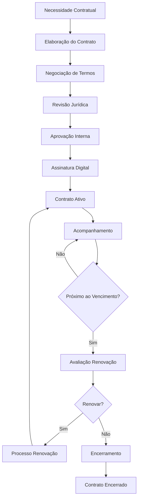

# 📋 Módulo: Gestão de Contratos

🏠 [Home](../../index.md) > 📋 [Módulos](../index.md) > **Gestão de Contratos**

#contratos #modulo #intermediario #gestao #juridico

---

## 📋 O que é

O módulo de **Gestão de Contratos** é responsável por centralizar e automatizar todo o ciclo de vida dos contratos da empresa. Este módulo permite criar, gerenciar, acompanhar vencimentos e renovações de contratos com clientes, fornecedores, funcionários e prestadores de serviços, garantindo maior controle jurídico e redução de riscos contratuais.


**💡 Benefícios**: Controle total dos contratos, alertas automáticos de vencimento, redução de riscos jurídicos e maior organização documental.


## 🎯 Principais Funcionalidades

<table data-view="cards">
<thead>
<tr>
<th></th>
<th></th>
<th data-hidden data-card-target data-type="content-ref"></th>
</tr>
</thead>
<tbody>
<tr>
<td><strong>📄 Criação de Contratos</strong></td>
<td>Crie contratos personalizados com templates pré-definidos</td>
<td></td>
</tr>
<tr>
<td><strong>⏰ Controle de Vencimentos</strong></td>
<td>Acompanhe prazos e receba alertas automáticos</td>
<td></td>
</tr>
<tr>
<td><strong>🔄 Renovações</strong></td>
<td>Gerencie renovações automáticas e manuais</td>
<td></td>
</tr>
<tr>
<td><strong>💰 Valores e Reajustes</strong></td>
<td>Controle valores, reajustes e indexadores</td>
<td></td>
</tr>
<tr>
<td><strong>📊 Relatórios</strong></td>
<td>Análises completas de contratos e performance</td>
<td></td>
</tr>
<tr>
<td><strong>🔐 Assinaturas Digitais</strong></td>
<td>Integração com sistemas de assinatura eletrônica</td>
<td></td>
</tr>
</tbody>
</table>

## 🚀 Como Acessar



### Acesso ao Módulo
1. No menu principal, clique em **"Módulos"**
2. Selecione **"Contratos"**
3. Escolha a funcionalidade desejada no submenu



### Verificação de Permissões
- Confirme se seu usuário tem permissão para acessar o módulo
- Verifique as permissões específicas para cada tipo de contrato



## 🔄 Ciclo de Vida dos Contratos

## 📋 Tipos de Contratos Suportados

### 🏢 Contratos Comerciais
- **Fornecimento de produtos**
- **Prestação de serviços**
- **Locação comercial**
- **Representação comercial**
- **Distribuição**

### 👥 Contratos Trabalhistas
- **Contratos de trabalho CLT**
- **Contratos de prestação de serviços**
- **Contratos temporários**
- **Acordos de confidencialidade**

### 🤝 Parcerias e Colaborações
- **Joint ventures**
- **Parcerias estratégicas**
- **Contratos de franquia**
- **Licenciamento**

### 🏦 Contratos Financeiros
- **Empréstimos e financiamentos**
- **Contratos de seguro**
- **Garantias bancárias**
- **Factoring**

## 🔧 Funcionalidades Detalhadas

### 📄 Gestão de Templates
- **Biblioteca de modelos** para diferentes tipos de contrato
- **Campos dinâmicos** para personalização automática
- **Cláusulas padrão** configuráveis
- **Versionamento** de templates

### ⏰ Alertas e Notificações
- **Alertas de vencimento** com antecedência configurável
- **Notificações de renovação**
- **Lembretes de revisão** periódica
- **Alertas de inadimplência**

### 💰 Controle Financeiro
- **Valores contratuais** e parcelas
- **Reajustes automáticos** por índices
- **Histórico de valores**
- **Integração com contas a receber/pagar**

### 📊 Dashboard de Contratos
- **Visão geral** dos contratos ativos
- **Contratos próximos ao vencimento**
- **Indicadores financeiros**
- **Gráficos de performance**

## 🔧 Configurações Necessárias


**⚠️ Pré-requisitos**: Antes de usar o módulo, certifique-se de que os seguintes itens estão configurados:


- ✅ **Cadastro de clientes e fornecedores** atualizado
- ✅ **Templates de contratos** configurados
- ✅ **Parâmetros de alertas** definidos
- ✅ **Usuários e permissões** configurados
- ✅ **Índices de reajuste** cadastrados
- ✅ **Workflow de aprovação** definido

## 💡 Casos de Uso Comuns

### 🏪 Comércio Varejista
- Contratos com fornecedores principais
- Acordos de exclusividade
- Contratos de locação de pontos comerciais

### 🏭 Indústria
- Contratos de fornecimento de matéria-prima
- Acordos de manutenção de equipamentos
- Contratos de terceirização

### 🏢 Prestação de Serviços
- Contratos recorrentes com clientes
- Acordos de nível de serviço (SLA)
- Contratos de consultoria

## 🚨 Pontos de Atenção


**🚨 Importante**: Sempre tenha revisão jurídica antes de finalizar contratos importantes ou de alto valor.



**⚠️ Atenção**: Configure alertas com antecedência suficiente para renovações e vencimentos.



**💡 Dica**: Mantenha um backup dos contratos assinados em formato digital e físico quando necessário.


## 🔐 Permissões e Segurança

### 👤 Níveis de Acesso
- **Consulta**: Visualizar contratos
- **Operacional**: Criar e editar contratos
- **Aprovação**: Aprovar contratos até determinado valor
- **Jurídico**: Acesso total e revisão legal
- **Gerencial**: Acesso total ao módulo

### 🔒 Controles de Segurança
- **Auditoria completa** de todas as operações
- **Criptografia** de documentos sensíveis
- **Controle de versões**
- **Backup automático** e redundante

## 📊 Relatórios Disponíveis

### 📈 Relatórios Gerenciais
- **Contratos por status**
- **Análise de vencimentos**
- **Performance de fornecedores/clientes**
- **Evolução de valores contratuais**

### 📋 Relatórios Operacionais
- **Contratos vencendo em X dias**
- **Renovações pendentes**
- **Contratos por categoria**
- **Histórico de alterações**

### 💰 Relatórios Financeiros
- **Valores contratuais por período**
- **Projeção de receitas/despesas**
- **Reajustes aplicados**
- **Análise de inadimplência**

## 🔍 Integração com Outros Módulos

O módulo de Contratos integra-se perfeitamente com:

- **💰 Financeiro**: Contas a receber e pagar
- **👥 Cadastros**: Clientes e fornecedores
- **📊 Contabilidade**: Lançamentos contábeis
- **🛒 Compras**: Contratos com fornecedores
- **💼 Vendas**: Contratos com clientes
- **👨‍💼 RH**: Contratos trabalhistas

## 🎯 Indicadores de Performance (KPIs)

### 📊 Métricas Principais
- **Taxa de renovação** de contratos
- **Tempo médio** de aprovação
- **Valor total** da carteira de contratos
- **Contratos vencidos** sem renovação

### 🚨 Alertas Críticos
- Contratos vencendo em **30, 15 e 7 dias**
- Contratos **vencidos** sem renovação
- **Valores em atraso**
- **Documentos pendentes** de assinatura

---

## 📚 Documentação Relacionada


cadastro-de-clientes.md



cadastro-de-fornecedores.md



contas-a-receber.md



contas-a-pagar.md


## 🏷️ Tags
`#contratos` `#modulo` `#intermediario` `#gestao` `#juridico` `#vencimentos` `#renovacoes` `#assinaturas` `#templates`

---

**Última atualização**: Setembro 2025  
**Versão do documento**: 1.0  
**Responsável**: Equipe de Documentação White ERP
