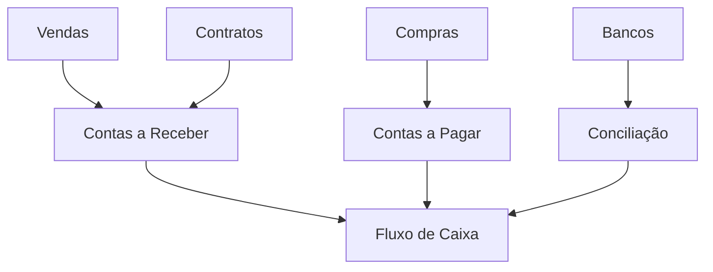

# 💰 Módulo: Gestão Financeira

🏠 [Home](../../index.md) > 📋 [Módulos](../index.md) > **💰 Financeiro**

#financeiro #contas #fluxo-caixa #cobranca #pagamento #fundamental

---

## 🎯 Visão Geral do Módulo

O **Módulo Financeiro** é o **centro de controle** das finanças do seu negócio. Aqui você gerencia todas as **entradas e saídas** de dinheiro, mantendo sua empresa sempre organizada e lucrativa.

### 🚀 **Por que o Controle Financeiro é Essencial?**
- 💰 **Fluxo de caixa saudável** - Saiba sempre quanto tem disponível
- 📊 **Tomada de decisões** - Dados precisos para escolhas inteligentes
- 🎯 **Planejamento estratégico** - Projete o futuro do seu negócio
- 📈 **Crescimento sustentável** - Reinvista com segurança
- 🔒 **Compliance fiscal** - Mantenha-se em dia com obrigações

> **💡 Dica Importante**: Um controle financeiro bem feito é a diferença entre crescer ou quebrar!

---

## 💸 Contas a Receber

### 📈 **[[contas-a-receber]]** - Gestão de Recebimentos
**Controle total** do que seus clientes devem

**Principais funcionalidades:**
- 💳 **Títulos em aberto** - Visualize tudo que deve receber
- 📅 **Controle de vencimentos** - Nunca perca um prazo
- 🏦 **Múltiplas formas** de recebimento (Dinheiro, Cartão, PIX, Boleto)
- 📧 **Cobrança automática** - Emails e WhatsApp
- 💰 **Juros e multas** - Aplicação automática
- 📊 **Relatórios de inadimplência** - Identifique problemas

**Casos de uso:**
- Venda à vista com recebimento futuro
- Parcelamento de vendas
- Controle de cheques pré-datados
- Negociação de dívidas em atraso

**Tags**: `#financeiro #receber #cobranca #inadimplencia #vencimento`

---

### 🏦 **[[boletos-e-cobranca]]** - Cobrança Automática
**Automatize cobranças** e reduza inadimplência

**Principais funcionalidades:**
- 📄 **Geração de boletos** - Automática ou manual
- 📧 **Envio por email** - Direto para o cliente
- 📱 **PIX integrado** - Pagamento instantâneo
- 🔄 **Retorno bancário** - Baixa automática
- ⚠️ **Alertas de vencimento** - Para você e cliente
- 📊 **Dashboard de cobrança** - Acompanhe resultados

**Benefícios:**
- Redução de inadimplência
- Automatização de processos
- Melhoria no fluxo de caixa
- Relacionamento profissional

**Tags**: `#boleto #cobranca #automatico #pix #email #bancario`

---

## 💳 Contas a Pagar

### 📉 **[[contas-a-pagar]]** - Gestão de Pagamentos
**Organize suas obrigações** financeiras

**Principais funcionalidades:**
- 📋 **Agenda de pagamentos** - Nunca atrase um pagamento
- 💰 **Fluxo de caixa** - Projete saídas futuras
- 🏦 **Integração bancária** - Pagamentos online
- 📊 **Categorização** - Organize por tipo de despesa
- 📅 **Programação** - Agende pagamentos recorrentes
- 📄 **Comprovantes** - Anexe documentos

**Casos de uso:**
- Pagamento de fornecedores
- Despesas operacionais
- Impostos e taxas
- Salários e encargos

**Tags**: `#financeiro #pagar #fornecedores #despesas #programacao`

---

### 🔄 **[[pagamentos-recorrentes]]** - Automação de Pagamentos
**Automatize pagamentos** fixos e recorrentes

**Principais funcionalidades:**
- 📅 **Pagamentos mensais** - Aluguel, energia, internet
- 💰 **Débito automático** - Configure uma vez, pague sempre
- 📊 **Controle de orçamento** - Monitore gastos fixos
- ⚠️ **Alertas preventivos** - Avise antes do vencimento
- 📈 **Histórico completo** - Acompanhe evolução
- 🔒 **Aprovação** - Controle de alçadas

**Tags**: `#recorrente #automatico #mensal #debito #orcamento`

---

## 📊 Fluxo de Caixa

### 💹 **[[fluxo-de-caixa]]** - Controle Financeiro
**Visão completa** da situação financeira

**Principais funcionalidades:**
- 💰 **Saldo atual** - Quanto tem disponível agora
- 📈 **Projeção futura** - Quanto terá nos próximos meses
- 📊 **Gráficos visuais** - Entenda rapidamente a situação
- 🏦 **Múltiplas contas** - Bancos, caixas, carteiras
- 📅 **Planejamento** - Projete cenários futuros
- ⚠️ **Alertas** - Quando o saldo estiver baixo

**Benefícios:**
- Nunca fique sem dinheiro
- Planeje investimentos
- Negocie melhor com fornecedores
- Tome decisões baseadas em dados

**Tags**: `#fluxo-caixa #saldo #projecao #planejamento #dashboard`

---

### 🏦 **[[conciliacao-bancaria]]** - Conciliação Automática
**Automatize** a conciliação bancária

**Principais funcionalidades:**
- 🔄 **Importação OFX** - Dados direto do banco
- ✅ **Conciliação automática** - Sistema encontra correspondências
- 📊 **Relatórios de diferenças** - Identifique divergências
- 🔍 **Busca inteligente** - Encontre transações similares
- 📅 **Histórico completo** - Acompanhe movimentações
- 💰 **Saldos atualizados** - Sempre em tempo real

**Tags**: `#conciliacao #bancaria #ofx #automatico #saldo`

---

## 📈 Análises e Relatórios

### 📊 **[[dre-demonstrativo]]** - DRE Gerencial
**Demonstrativo de resultados** do exercício

**Principais funcionalidades:**
- 📈 **Receitas** - Todas as entradas do período
- 📉 **Despesas** - Gastos organizados por categoria
- 💰 **Lucro líquido** - Resultado final do período
- 📊 **Comparativos** - Mês a mês, ano a ano
- 🎯 **Margem de lucro** - Percentual de rentabilidade
- 📋 **Detalhamento** - Drill-down por categoria

**Benefícios:**
- Entenda a rentabilidade real
- Identifique gastos excessivos
- Compare períodos
- Tome decisões estratégicas

**Tags**: `#dre #receitas #despesas #lucro #rentabilidade #comparativo`

---

### 📋 **[[centro-de-custos]]** - Gestão de Custos
**Organize gastos** por departamento ou projeto

**Principais funcionalidades:**
- 🏢 **Departamentos** - Vendas, Marketing, Administrativo
- 🎯 **Projetos** - Custos por projeto específico
- 📊 **Rateio** - Distribua custos proporcionalmente
- 📈 **Análise de performance** - Compare departamentos
- 💰 **Orçamento** - Defina limites por centro
- 📋 **Relatórios detalhados** - Análise profunda

**Tags**: `#centro-custos #departamento #projeto #rateio #orcamento`

---

## 💳 Formas de Pagamento

### 💰 **[[formas-pagamento]]** - Gestão de Pagamentos
**Configure** todas as formas de recebimento

**Formas disponíveis:**
- 💵 **Dinheiro** - À vista com troco
- 💳 **Cartão de crédito** - Parcelado com juros
- 💳 **Cartão de débito** - À vista com desconto
- 📱 **PIX** - Instantâneo 24/7
- 📄 **Boleto** - Para pagamento posterior
- 📝 **Cheque** - Pré-datado ou à vista
- 🏦 **Transferência** - TED/DOC
- 📱 **Carteiras digitais** - PicPay, PayPal

**Configurações:**
- **Taxas** - Configure taxas por forma
- **Prazos** - Defina prazos de recebimento
- **Descontos** - Incentive pagamentos à vista
- **Parcelamento** - Configure limites e juros

**Tags**: `#pagamento #cartao #pix #boleto #dinheiro #cheque`

---

### 🏦 **[[tef-integracao]]** - TEF Integrado
**Integração** com máquinas de cartão

**Principais funcionalidades:**
- 💳 **Pagamento direto** - Do PDV para a máquina
- 📊 **Controle automático** - Baixa automática
- 🔄 **Cancelamento** - Estorno direto
- 📈 **Relatórios** - Vendas por bandeira
- 💰 **Taxas** - Controle de taxas por operadora
- 📅 **Agenda** - Previsão de recebimentos

**Benefícios:**
- Agilidade no atendimento
- Redução de erros
- Controle automático
- Melhor experiência do cliente

**Tags**: `#tef #cartao #maquina #integracao #automatico #pdv`

---

## 🔄 Fluxos Financeiros

### 📋 **Sequência de Processos Financeiros**

#### **1️⃣ Recebimento de Vendas**
1. **Venda realizada** → Título a receber gerado
2. **Cobrança enviada** → Email/WhatsApp automático
3. **Pagamento recebido** → Baixa automática
4. **Conciliação** → Confirmação bancária

#### **2️⃣ Pagamento de Fornecedores**
1. **Compra realizada** → Título a pagar gerado
2. **Agendamento** → Programação do pagamento
3. **Aprovação** → Validação do pagamento
4. **Execução** → Pagamento realizado

#### **3️⃣ Controle de Caixa**
1. **Abertura** → Saldo inicial informado
2. **Movimentação** → Vendas e pagamentos
3. **Sangria/Reforço** → Ajustes de caixa
4. **Fechamento** → Conferência do saldo

---

## 💡 Dicas de Melhores Práticas

### ✅ **Organização Financeira**
1. **Categorize** todas as movimentações
2. **Concilie** contas bancárias diariamente
3. **Monitore** indicadores-chave
4. **Planeje** com base em dados históricos
5. **Automatize** processos repetitivos

### 🚀 **Otimização de Fluxo**
1. **Negocie** prazos com fornecedores
2. **Incentive** pagamentos à vista
3. **Monitore** inadimplência
4. **Diversifique** formas de pagamento
5. **Automatize** cobranças

### 🔒 **Segurança Financeira**
1. **Mantenha** reserva de emergência
2. **Controle** acesso por usuário
3. **Faça** backup dos dados
4. **Monitore** movimentações suspeitas
5. **Valide** todas as transações

---

## 📊 Indicadores Financeiros

### 📈 **KPIs Essenciais**
- **Faturamento Mensal**: Receita total do mês
- **Margem de Lucro**: Percentual de rentabilidade
- **Inadimplência**: Percentual de atraso
- **Ticket Médio**: Valor médio por venda
- **Prazo Médio de Recebimento**: Dias para receber
- **Giro de Caixa**: Velocidade do dinheiro

### 📋 **Relatórios Recomendados**
- **DRE Mensal**: Resultado do exercício
- **Fluxo de Caixa**: Projeção 90 dias
- **Contas em Atraso**: Inadimplência
- **Ranking de Clientes**: Maiores compradores
- **Análise de Custos**: Gastos por categoria

---

## 🔗 Integrações Financeiras

### 🤝 **Como o Financeiro se Conecta**

### 🔄 **Automações Disponíveis**
- **Venda** → **Título a Receber** → **Cobrança**
- **Compra** → **Título a Pagar** → **Agendamento**
- **Pagamento** → **Baixa Automática** → **Conciliação**
- **Vencimento** → **Alerta** → **Cobrança**

---

## 🚨 Problemas Comuns e Soluções

### ❌ **Saldo Divergente**
**Possíveis causas:**
- Movimentações não conciliadas
- Títulos duplicados
- Erro de digitação
- Falta de sincronização

**Soluções:**
1. **Conciliar** contas bancárias
2. **Verificar** títulos duplicados
3. **Revisar** lançamentos manuais
4. **Sincronizar** dados

### ❌ **Inadimplência Alta**
**Possíveis causas:**
- Falta de cobrança
- Clientes sem cadastro
- Análise de crédito deficiente
- Processo de cobrança ineficiente

**Soluções:**
1. **Automatizar** cobranças
2. **Melhorar** análise de crédito
3. **Diversificar** formas de pagamento
4. **Negociar** dívidas em atraso

### ❌ **Fluxo de Caixa Negativo**
**Possíveis causas:**
- Vendas baixas
- Gastos excessivos
- Prazo de recebimento longo
- Falta de planejamento

**Soluções:**
1. **Analisar** gastos desnecessários
2. **Negociar** prazos de pagamento
3. **Incentivar** pagamentos à vista
4. **Planejar** fluxo futuro

---

## 🎯 Próximos Passos

### 📚 **Para Iniciantes**
1. **Configure** formas de pagamento
2. **Cadastre** contas bancárias
3. **Teste** cobrança automática
4. **Monitore** fluxo de caixa diário

### 🎯 **Para Usuários Avançados**
1. **Implemente** centro de custos
2. **Automatize** conciliação bancária
3. **Configure** relatórios personalizados
4. **Analise** indicadores financeiros

### 🚀 **Para Especialistas**
1. **Desenvolva** dashboards executivos
2. **Integre** com sistemas bancários
3. **Implemente** aprovação por alçada
4. **Automatize** processos complexos

---

## 📚 Documentação Relacionada

### 🔗 **Módulos Relacionados**
- **[[../vendas/index]]** - Gera contas a receber
- **[[../compras/index]]** - Gera contas a pagar
- **[[../contratos/index]]** - Faturamento recorrente
- **[[../relatorios/index]]** - Análises financeiras

### 📋 **Fluxos Relacionados**
- **[[../../fluxos/fluxo-vendas-completo]]** - Do pedido ao recebimento
- **[[../../fluxos/fluxo-compras]]** - Da compra ao pagamento
- **[[../../fluxos/fluxo-cobranca]]** - Processo de cobrança
- **[[../../fluxos/fluxo-fechamento]]** - Fechamento mensal

### 💡 **Casos de Uso**
- **[[../../casos-uso/comercio-geral/controle-caixa]]** - Gestão de caixa
- **[[../../casos-uso/servicos/faturamento-recorrente]]** - Contratos
- **[[../../casos-uso/servicos/cobranca-servicos]]** - Cobrança especializada

---

## 📋 Checklist Financeiro

### ✅ **Configuração Inicial**
- [ ] Contas bancárias cadastradas
- [ ] Formas de pagamento configuradas
- [ ] Categorias de receita/despesa criadas
- [ ] Usuários com permissões definidas

### ✅ **Controles Diários**
- [ ] Vendas lançadas automaticamente
- [ ] Pagamentos registrados
- [ ] Caixa conferido e fechado
- [ ] Conciliação bancária realizada

### ✅ **Controles Mensais**
- [ ] DRE gerado e analisado
- [ ] Inadimplência controlada
- [ ] Fluxo de caixa projetado
- [ ] Relatórios gerenciais revisados

### ✅ **Qualidade dos Dados**
- [ ] Títulos categorizados corretamente
- [ ] Dados bancários atualizados
- [ ] Clientes com dados completos
- [ ] Backup realizado regularmente

---

**💡 Dica Final**: O controle financeiro é o termômetro da saúde do seu negócio. Mantenha-o sempre atualizado e use os dados para tomar decisões inteligentes!

---

**Tags relacionadas**: #financeiro #contas #fluxo-caixa #cobranca #pagamento #fundamental #dre #inadimplencia 